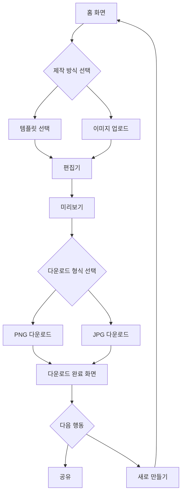

# 카드·밈 제작 웹 도구 개발요청서

## 목차

1. 문서 개요
2. 프로젝트 배경
3. 문제 정의
4. 프로젝트 목표
5. 제품 포지셔닝
6. 타깃 사용자
7. 사용자 페르소나
8. 핵심 사용자 시나리오
9. 경쟁 서비스 조사 요약
10. 차별화 전략
11. 서비스 범위
12. MVP 정의
13. 기능 요구사항
14. 편집기 기능 명세
15. 텍스트 및 폰트 요구사항
16. 이미지 및 레이어 기능
17. 다운로드 기능
18. 템플릿 및 에셋 요구사항
19. 화면 설계 및 UX 요구사항
20. 사용자 플로우
21. 데이터 구조
22. 기술 스택
23. 프론트엔드 구조
24. 저장·처리 구조
25. 외부 API 및 라이브러리
26. 반응형·모바일 요구사항
27. 성능 요구사항
28. 보안·개인정보 요구사항
29. 저작권·라이선스 정책
30. 접근성 요구사항
31. 오류 및 예외 처리
32. 관리자 기능
33. MVP 제외 기능
34. 2차 개발 기능
35. QA 테스트 시나리오
36. 완료 조건
37. 개발 일정
38. 우선순위
39. 리스크 및 대응 방안
40. 초기 수익화 가능성
41. 개발 착수 체크리스트
42. 최종 개발 지시사항
43. 야구 결과 카드뉴스 탭
44. 백엔드 구조

---

## 1. 문서 개요

| 항목 | 내용 |
|---|---|
| 프로젝트명 | 카드·밈 제작 웹 도구 |
| 문서 목적 | 개발팀용 상세 개발요청서 |
| 서비스 유형 | 웹 기반 이미지·밈 제작 편집기 |
| 주요 이용자 | 일반 사용자, SNS 제작자, 마케팅 담당자 |
| 주요 플랫폼 | 모바일 웹·PC 웹 |
| 기본 언어 | 한국어 |
| 초기 운영 방식 | 무료 |
| 핵심 결과물 | PNG·JPG 이미지 |
| MVP 핵심 | 이미지 업로드 → 텍스트 편집 → 이미지 다운로드 |
| 개발 우선순위 | MVP 우선·단계적 확장 |

---

## 2. 프로젝트 배경

- 밈, 카드뉴스, SNS용 이미지를 빠르게 만들고 싶어하는 수요가 꾸준히 존재하지만, 대부분의 전문 디자인 도구는 기능이 많고 학습 곡선이 있어 비전문가에게 부담스럽다.
- Canva, 미리캔버스 등 기존 도구는 강력하지만 회원가입, 복잡한 메뉴 구조, 유료 결제 유도 등으로 인해 "빠르게 한 장만 만들고 싶은" 사용자에게는 과한 경우가 많다.
- 해외 중심 밈 제작 도구(Imgflip 등)는 한글 폰트·한글 조합 입력·한영 혼합 텍스트 처리에 대한 지원이 상대적으로 약할 가능성이 있다(확인 필요).
- 한글은 초성·중성·종성 조합 특성과 한영 혼합 사용이 흔해, 영문 중심으로 설계된 텍스트 엔진에서 줄바꿈·자간·렌더링 오류가 발생하기 쉽다.
- 모바일에서 텍스트를 손가락으로 정교하게 배치하거나 빠르게 결과물을 완성하기 어려운 도구가 많다.
- 많은 무료 도구가 워터마크 삽입, 해상도 제한, 다운로드 횟수 제한 등으로 무료 사용 경험을 제한한다.
- 무료 한글 폰트, 무료 이미지·아이콘의 상업적 이용 가능 여부를 사용자가 직접 확인하기 어렵고, 라이선스 위반 위험이 존재한다.

---

## 3. 문제 정의

| 문제 | 사용자 불편 | 기존 대안 | 우리가 해결하는 방법 | MVP 반영 |
|---|---|---|---|---|
| 전문 디자인 도구의 높은 진입장벽 | 메뉴가 복잡하고 학습 시간이 필요함 | Canva, Adobe Express | 업로드→텍스트→다운로드의 최소 흐름만 제공 | O |
| 한글 텍스트 처리 품질 저하 | 글자가 깨지거나 줄바꿈이 부자연스러움 | 해외 밈 도구 | 한글·영문 혼합 렌더링을 핵심 품질 기준으로 설계 | O |
| 모바일에서 제작이 번거로움 | 터치로 정교한 편집이 어려움 | PC 전용 도구 | 모바일 퍼스트 UI, 큰 터치 영역 설계 | O |
| 무료 사용 시 워터마크·해상도 제한 | 결과물 품질이 낮아짐 | 대부분의 무료 플랜 | 초기에는 워터마크 없는 기본 다운로드 제공(정책은 운영 중 재검토) | O |
| 에셋 라이선스 확인 어려움 | 상업적 이용 가능 여부를 알기 어려움 | 개별 검색 필요 | 템플릿·에셋별 출처·라이선스 정보를 문서화 | O |
| 회원가입 없이는 사용 불가 | 가입 절차가 진입장벽이 됨 | 대부분의 경쟁 서비스 | 로그인 없이 핵심 기능 사용 가능 | O |
| 결과물을 SNS에 바로 공유하기 어려움 | 다운로드 후 별도 앱에서 공유해야 함 | 대부분의 도구 | Web Share API 연동 검토 | P1 |

---

## 4. 프로젝트 목표

### 정량적 목표

| 목표 항목 | 목표 수치 | 구분 |
|---|---|---|
| 첫 화면 로딩 시간 | 3초 이내(4G 기준) | 초기 목표 |
| 첫 결과물 제작 시간 | 모바일 1~3분 이내 | 초기 목표 |
| 이미지 다운로드 성공률 | 95% 이상 | 검증 필요 |
| 모바일 주요 브라우저 지원 | Chrome, Safari 최신 2개 버전 | 초기 목표 |
| 한글 입력 오류 | 0건 목표 | 가정 |
| MVP 개발 기간 | 약 2~3주(1인 기준) | 가정 |

### 정성적 목표

- 디자인 경험이 없는 사용자도 별도 설명 없이 사용할 수 있어야 한다.
- 한글 텍스트가 편집기 화면과 다운로드 결과물에서 동일하게 자연스럽게 표시되어야 한다.
- 전문 지식 없이도 원하는 결과물을 만들 수 있어야 한다.
- 모바일 환경에서 조작이 답답하지 않아야 한다.
- 핵심 기능은 무료로 제한 없이 사용할 수 있어야 한다.

---

## 5. 제품 포지셔닝

> 이 서비스는 `밈·카드뉴스·SNS 이미지를 빠르게 만들고 싶은 일반 사용자와 소규모 브랜드`가 `복잡한 디자인 도구 없이 한글 텍스트가 자연스러운 이미지를 빠르게 제작하는 것`을 해결하기 위해 사용하는 `웹 기반 이미지·밈 제작 편집기`이며, `설치·가입 없는 즉시 사용, 한글·한영 혼합 텍스트 최적화, 모바일 중심 UX`를 제공한다.

- **한 줄 소개**: 가입 없이, 브라우저에서 바로 만드는 한글 밈·카드뉴스 제작 도구
- **짧은 광고 문구**: "1분이면 충분해요, 지금 바로 밈 만들기"
- **핵심 가치**: 빠름, 쉬움, 한글 친화적, 무료
- **경쟁 서비스 대비 차별점**: 가입 없는 즉시 사용, 한글·한영 혼합 텍스트 최적화, 모바일 우선 설계
- **MVP에서 포기할 것**: 고급 디자인 기능, 협업 기능, 대규모 템플릿 마켓, 계정 기반 저장

---

## 6. 타깃 사용자

- 밈을 빠르게 제작하려는 일반 사용자
- SNS 게시물을 제작하는 개인
- 한글 텍스트가 포함된 이미지를 제작하는 한국 사용자
- 소규모 브랜드·마케팅 담당자
- 커뮤니티 운영자
- 블로그·뉴스레터·메신저용 이미지를 만드는 사용자

| 사용자 그룹 | 주요 목적 | 사용 빈도(가정) | 기술 숙련도 |
|---|---|---|---|
| 일반 사용자(밈 제작) | 재미·공유 목적의 밈 제작 | 비정기적, 급할 때 사용 | 낮음~중간 |
| SNS 개인 제작자 | 게시물용 이미지 제작 | 주 1~3회 | 중간 |
| 소규모 브랜드·마케팅 담당자 | 홍보용 카드뉴스 제작 | 주 1~5회 | 중간~높음 |
| 커뮤니티 운영자 | 공지·이벤트 이미지 제작 | 비정기적 | 낮음~중간 |

---

## 7. 사용자 페르소나

| 페르소나 | 사용 목적 | 주 이용 기기 | 가장 큰 불편 | 필요한 기능 | 예상 사용 빈도 |
|---|---|---|---|---|---|
| 김밈생(20대, 대학생) | 커뮤니티·단톡방용 밈 제작 | 모바일 | 기존 밈 도구의 한글 지원 부족 | 빠른 텍스트 삽입, 템플릿 | 주 2~3회 |
| 박마케터(30대, 소상공인 마케팅 담당) | SNS 홍보 카드뉴스 제작 | PC + 모바일 | 디자인 도구 학습 부담 | 템플릿, 브랜드 색상 적용 | 주 3~5회 |
| 이운영자(30대, 온라인 커뮤니티 운영자) | 공지·이벤트 안내 이미지 제작 | PC | 매번 비슷한 작업 반복 | 저장된 스타일 재사용, 빠른 편집 | 비정기적, 이벤트 시 집중 |
| 최블로거(20대, 개인 블로거) | 블로그·뉴스레터 삽화 제작 | 모바일 | 무료 이미지 저작권 확인 어려움 | 라이선스 명확한 무료 에셋 | 주 1~2회 |

### 김밈생

- **프로필**: 22세, 대학생, 밈 커뮤니티 활동 활발
- **사용 상황**: 친구 단톡방에서 화제가 된 사진에 재미있는 문구를 빠르게 넣고 싶음
- **원하는 결과**: 30초~1분 내 완성된 밈을 PNG로 저장해 공유
- **사용 중단 이유**: 가입을 요구하거나 워터마크가 붙는 경우
- **가장 먼저 사용할 기능**: 이미지 업로드 → 텍스트 추가

### 박마케터

- **프로필**: 34세, 카페 운영 겸 SNS 마케팅 담당
- **사용 상황**: 매주 인스타그램 홍보 카드뉴스 제작
- **원하는 결과**: 일관된 스타일의 카드뉴스를 빠르게 여러 장 제작
- **사용 중단 이유**: 브랜드 색상·폰트를 반영하기 어려운 경우
- **가장 먼저 사용할 기능**: 템플릿 선택 → 문구 수정

### 이운영자

- **프로필**: 37세, 온라인 커뮤니티 운영자
- **사용 상황**: 이벤트·공지사항 이미지를 정기적으로 제작
- **원하는 결과**: 이전 작업과 비슷한 스타일을 빠르게 재현
- **사용 중단 이유**: 매번 처음부터 다시 만들어야 하는 경우
- **가장 먼저 사용할 기능**: 템플릿 선택 → 이미지 교체

### 최블로거

- **프로필**: 26세, 개인 블로그·뉴스레터 운영
- **사용 상황**: 글에 들어갈 삽화 이미지를 저작권 걱정 없이 제작
- **원하는 결과**: 상업적 이용이 가능한 무료 에셋으로 만든 이미지
- **사용 중단 이유**: 에셋 라이선스가 불명확한 경우
- **가장 먼저 사용할 기능**: 배경 이미지 선택 → 텍스트 추가

---

## 8. 핵심 사용자 시나리오

### 시나리오 A: 이미지에 한글 문구 넣기

```text
사이트 접속
→ 이미지 업로드
→ 텍스트 입력
→ 폰트·색상·크기 변경
→ 텍스트 위치 이동
→ 미리보기
→ PNG 다운로드
```

| 단계 | 사용자 행동 | 화면 변화 | 시스템 동작 | 필요한 UI | 오류 가능성 | 성공 조건 |
|---|---|---|---|---|---|---|
| 1 | 사이트 접속 | 홈 화면 표시 | 초기 리소스 로딩 | 홈 화면, CTA 버튼 | 네트워크 지연 | 3초 이내 화면 표시 |
| 2 | 이미지 업로드 | 파일 선택창 표시 후 캔버스에 이미지 반영 | 파일 형식·크기 검증, 브라우저 내 디코딩 | 업로드 버튼, 드래그앤드롭 영역 | 미지원 형식, 용량 초과 | 캔버스에 이미지 정상 표시 |
| 3 | 텍스트 입력 | 텍스트 박스 생성 | 텍스트 레이어 객체 생성 | 텍스트 추가 버튼, 입력창 | 한글 조합 중 입력 오류 | 입력한 문구가 그대로 표시 |
| 4 | 폰트·색상·크기 변경 | 스타일 패널에서 실시간 반영 | 텍스트 레이어 속성 업데이트 | 스타일 패널(폰트, 색상, 크기) | 웹폰트 로딩 지연 | 변경 사항이 캔버스에 즉시 반영 |
| 5 | 텍스트 위치 이동 | 드래그 시 텍스트 이동 | 좌표 값 갱신 | 드래그 핸들 | 캔버스 밖으로 이탈 | 원하는 위치에 정확히 배치 |
| 6 | 미리보기 | 편집 UI 숨김, 결과 미리보기 표시 | 캔버스를 이미지로 렌더링 | 미리보기 버튼 | 렌더링 지연 | 최종 결과물과 동일하게 표시 |
| 7 | PNG 다운로드 | 다운로드 완료 알림 | Canvas → Blob → 파일 저장 | 다운로드 버튼 | 다운로드 실패 | 기기에 PNG 파일 저장 |

### 시나리오 B: 템플릿으로 카드 만들기

```text
사이트 접속
→ 템플릿 선택
→ 문구 수정
→ 이미지 변경
→ 색상 변경
→ JPG 다운로드
```

| 단계 | 사용자 행동 | 화면 변화 | 시스템 동작 | 필요한 UI | 오류 가능성 | 성공 조건 |
|---|---|---|---|---|---|---|
| 1 | 템플릿 선택 | 템플릿 목록 → 편집기 전환 | 템플릿 데이터 로드 후 레이어 생성 | 템플릿 목록, 썸네일 | 템플릿 로딩 실패 | 편집기에 템플릿 반영 |
| 2 | 문구 수정 | 텍스트 박스 내용 변경 | 텍스트 레이어 값 갱신 | 텍스트 편집 영역 | 텍스트 길이 초과 | 수정 문구 정상 반영 |
| 3 | 이미지 변경 | 이미지 레이어 교체 | 새 이미지 업로드·디코딩 | 이미지 교체 버튼 | 업로드 실패 | 새 이미지로 정상 교체 |
| 4 | 색상 변경 | 배경·텍스트 색상 변경 | 레이어 속성 갱신 | 색상 피커 | 대비 부족 경고 미표시 | 선택 색상 즉시 반영 |
| 5 | JPG 다운로드 | 다운로드 완료 알림 | Canvas → JPEG 인코딩 | 다운로드 버튼, 품질 옵션 | 압축 품질 저하 | 기기에 JPG 파일 저장 |

### 시나리오 C: 모바일에서 제작하기

```text
모바일 접속
→ 템플릿 선택
→ 텍스트 입력
→ 손가락으로 위치 조정
→ 결과물 저장
→ 공유
```

| 단계 | 사용자 행동 | 화면 변화 | 시스템 동작 | 필요한 UI | 오류 가능성 | 성공 조건 |
|---|---|---|---|---|---|---|
| 1 | 모바일 접속 | 모바일 최적화 홈 화면 | 반응형 레이아웃 렌더링 | 세로형 홈 화면 | 저사양 기기 로딩 지연 | 3초 이내 표시 |
| 2 | 템플릿 선택 | 템플릿 그리드 → 편집기 전환 | 템플릿 데이터 로드 | 스크롤 가능한 템플릿 목록 | 터치 오작동 | 선택 템플릿 정상 진입 |
| 3 | 텍스트 입력 | 가상 키보드 표시, 레이아웃 조정 | 키보드 높이만큼 캔버스 영역 재배치 | 텍스트 입력창 | 키보드가 캔버스를 가림 | 입력 중에도 캔버스 확인 가능 |
| 4 | 손가락으로 위치 조정 | 터치 드래그로 텍스트 이동 | 터치 좌표 → 레이어 좌표 변환 | 터치 핸들(충분한 크기) | 미세 조정 어려움 | 의도한 위치로 이동 |
| 5 | 결과물 저장 | 다운로드 완료 알림 | 모바일 브라우저 다운로드 처리 | 저장 버튼 | 모바일 저장 권한 문제 | 갤러리·파일함에 저장 |
| 6 | 공유 | 공유 시트 표시 | Web Share API 호출 | 공유 버튼 | 공유 API 미지원 | 최소 다운로드는 성공 |

---

## 9. 경쟁 서비스 조사 요약

| 서비스 | 한글 지원 | 템플릿 | 이미지 업로드 | 텍스트 편집 | PNG/JPG 다운로드 | 워터마크 | 무료 범위 | 상업적 이용 | 확인 사항 |
|---|---|---|---|---|---|---|---|---|---|
| Canva | 지원 | 매우 풍부 | 지원 | 지원 | 지원 | 일부 유료 요소 존재 | 넓음(일부 제한) | 플랜에 따라 다름 | 확인 필요 |
| Adobe Express | 지원 | 풍부 | 지원 | 지원 | 지원 | 확인 필요 | 확인 필요 | 확인 필요 | 확인 필요 |
| Imgflip | 제한적 가능성 | 밈 중심 | 지원 | 지원(영문 중심) | 지원 | 확인 필요 | 넓음 | 확인 필요 | 확인 필요 |
| Kapwing | 확인 필요 | 있음 | 지원 | 지원 | 지원 | 확인 필요 | 확인 필요 | 확인 필요 | 확인 필요 |
| 미리캔버스 | 지원(한국 서비스) | 매우 풍부 | 지원 | 지원 | 지원 | 확인 필요 | 넓음(일부 제한) | 확인 필요 | 확인 필요 |
| 망고보드 | 지원(한국 서비스) | 풍부 | 지원 | 지원 | 지원 | 확인 필요 | 유료 중심 | 확인 필요 | 확인 필요 |

| 서비스 | 강점 | 약점 | 우리가 차별화할 부분 |
|---|---|---|---|
| Canva | 방대한 템플릿, 강력한 편집 기능 | 기능이 많아 복잡함, 가입 필요 | 가입 없는 즉시 사용, 단순한 흐름 |
| Adobe Express | Adobe 생태계 연동 | 초보자에게 다소 무거움 | 최소 기능으로 빠른 제작 |
| Imgflip | 밈 제작에 특화, 빠름 | 한글 지원 품질 확인 필요 | 한글·한영 혼합 텍스트 최적화 |
| Kapwing | 영상·이미지 통합 도구 | 이미지 전용 사용자에게 과함 | 이미지·밈 제작에 집중한 단순함 |
| 미리캔버스 | 한국어 UI, 풍부한 한국형 템플릿 | 기능이 많아 학습 필요 | 모바일 중심의 초경량 편집 흐름 |
| 망고보드 | 전문적인 카드뉴스 템플릿 | 무료 범위가 좁을 가능성 | 핵심 기능 무료 제공 |

---

## 10. 차별화 전략

- 한국어·한영 혼합 텍스트 최적화
- 빠른 밈 제작(가입 없이 1~3분 내 완성)
- 모바일 중심 UX
- 초보자용 단순 인터페이스
- 워터마크 없는 무료 기본 다운로드
- 한국형 밈 템플릿
- 무료 폰트와 라이선스 정보 제공
- 설치 없는 즉시 사용
- 로컬 브라우저 처리로 개인정보 보호
- 결과물 공유 최적화

| 차별화 요소 | 사용자 가치 | 개발 난이도 | 경쟁 우위 | MVP 여부 |
|---|---|---:|---|---|
| 한글·한영 혼합 텍스트 최적화 | 글자 깨짐·줄바꿈 오류 없는 결과물 | 중 | 높음 | O |
| 가입 없는 즉시 사용 | 진입장벽 제거 | 하 | 높음 | O |
| 모바일 중심 UX | 이동 중에도 빠른 제작 | 중 | 중간 | O |
| 워터마크 없는 기본 다운로드 | 완성도 높은 무료 결과물 | 하 | 중간 | O |
| 한국형 밈 템플릿 | 즉시 사용 가능한 소재 제공 | 중 | 중간 | P1 |
| 로컬 브라우저 처리 | 개인정보 안심 사용 | 중 | 중간 | O |
| 결과물 공유 최적화 | 완성 후 바로 공유 가능 | 하 | 낮음 | P1 |

---

## 11. 서비스 범위

### 포함 범위

- 이미지 업로드
- 이미지 미리보기
- 이미지 자르기 또는 위치 조정
- 캔버스 크기 조정
- 텍스트 추가
- 여러 텍스트 박스
- 텍스트 이동
- 텍스트 크기 조절
- 글꼴 변경
- 글자 색상
- 굵게·기울임
- 외곽선
- 그림자
- 텍스트 배경
- 레이어 순서 조정
- 실행 취소·다시 실행
- PNG 다운로드
- JPG 다운로드
- 모바일 반응형

### 초기 제외 범위

| 제외 기능         | 제외 이유                    |
| ------------- | ------------------------ |
| 회원가입          | MVP 목표(가입 없는 즉시 사용)와 상충  |
| 로그인           | 서버·인증 구조 필요로 개발 범위 확대    |
| 클라우드 저장       | 서버·스토리지 비용 및 개인정보 이슈 발생  |
| 팀 협업          | 실시간 동기화 구조 필요, MVP 범위 초과 |
| 실시간 공동 편집     | 기술 복잡도가 높고 핵심 가치와 무관     |
| 동영상 편집        | 별도 렌더링 엔진 필요, 범위 초과      |
| GIF 편집        | 프레임 처리 복잡도 높음            |
| 복잡한 AI 이미지 생성 | 유료 API 의존도가 커짐           |
| 유료 결제         | 초기 무료 서비스 원칙과 상충         |
| 대규모 템플릿 마켓    | 콘텐츠 심사·정산 구조 필요          |
| 고급 사진 보정      | 이미지 처리 성능 부담 큼           |
| 복잡한 관리자 시스템   | 서버 없는 초기 운영 방식과 상충       |

---

## 12. MVP 정의

> 사용자가 이미지를 업로드하고, 한글 또는 영문 텍스트를 추가하고, 기본 스타일을 편집한 후 PNG 또는 JPG로 다운로드할 수 있다.

| ID | 기능명 | 설명 | 우선순위 | 난이도 | 완료 기준 |
|---|---|---|---|---:|---|
| F-01 | 이미지 업로드 | 사용자 이미지를 캔버스에 표시 | P0 | 하 | 업로드 즉시 캔버스에 표시됨 |
| F-02 | 텍스트 추가 | 캔버스 위에 텍스트 박스 생성 | P0 | 하 | 입력한 텍스트가 정상 표시됨 |
| F-03 | 텍스트 스타일 편집 | 폰트, 크기, 색상, 굵기 등 변경 | P0 | 중 | 변경 사항이 실시간 반영됨 |
| F-04 | 텍스트·이미지 위치 이동 | 드래그로 위치 조정 | P0 | 중 | 원하는 위치로 정확히 이동됨 |
| F-05 | PNG/JPG 다운로드 | 결과물을 이미지 파일로 저장 | P0 | 중 | 파일이 기기에 정상 저장됨 |
| F-06 | 모바일 반응형 UI | 모바일에서도 동일 기능 제공 | P0 | 중 | 모바일에서 전 기능 동작 |
| F-07 | 템플릿 선택 | 사전 제작된 템플릿으로 시작 | P1 | 중 | 템플릿 선택 시 편집기에 반영 |
| F-08 | 실행 취소·다시 실행 | 편집 이력 되돌리기 | P1 | 중 | 최근 동작을 취소·복원 가능 |
| F-09 | 레이어 순서 조정 | 요소 간 앞뒤 순서 변경 | P1 | 중 | 순서 변경이 렌더링에 반영됨 |
| F-10 | 스티커·도형 추가 | 기본 스티커·도형 삽입 | P2 | 중 | 캔버스에 정상 배치됨 |

---

## 13. 기능 요구사항

### 이미지 업로드

- 기능 ID: F-01
- 우선순위: P0
- 사용자 목적: 편집할 원본 이미지를 캔버스에 불러온다.
- 진입 조건: 홈 화면 또는 편집기에서 업로드 버튼/드래그앤드롭 사용
- 사용자 행동: 파일 선택 또는 드래그앤드롭
- 시스템 동작: 파일 형식·크기 검증 후 브라우저 내 디코딩, 캔버스에 렌더링
- 필요한 UI: 업로드 버튼, 드래그앤드롭 영역, 진행 표시
- 입력값: 이미지 파일(JPG, PNG, WebP)
- 출력값: 캔버스에 표시된 이미지 레이어
- 오류 상황: 미지원 형식, 용량 초과, 손상된 파일
- 완료 조건: 이미지가 캔버스에 정상적으로 표시됨
- MVP 포함 여부: 포함

### 이미지 삭제

- 기능 ID: F-01-1
- 우선순위: P1
- 사용자 목적: 불필요한 이미지 레이어 제거
- 진입 조건: 레이어 패널 또는 선택된 이미지에서 삭제 실행
- 사용자 행동: 삭제 버튼 클릭 또는 삭제 키 입력
- 시스템 동작: 해당 레이어 객체 제거 후 캔버스 재렌더링
- 필요한 UI: 삭제 버튼, 컨텍스트 메뉴
- 입력값: 선택된 레이어 ID
- 출력값: 레이어가 제거된 캔버스
- 오류 상황: 배경 레이어 삭제 시도
- 완료 조건: 레이어 목록에서 즉시 사라짐
- MVP 포함 여부: 포함

### 이미지 교체

- 기능 ID: F-01-2
- 우선순위: P1
- 사용자 목적: 기존 이미지를 새 이미지로 대체
- 진입 조건: 이미지 레이어 선택 후 교체 실행
- 사용자 행동: 새 파일 선택
- 시스템 동작: 기존 레이어 속성(위치, 크기)을 유지한 채 이미지 소스만 교체
- 필요한 UI: 이미지 교체 버튼
- 입력값: 새 이미지 파일
- 출력값: 교체된 이미지 레이어
- 오류 상황: 새 파일 로딩 실패
- 완료 조건: 새 이미지가 기존 위치·크기로 표시됨
- MVP 포함 여부: 포함(템플릿 사용 시 필수)

### 이미지 자르기

- 기능 ID: F-01-3
- 우선순위: P1
- 사용자 목적: 이미지의 특정 영역만 사용
- 진입 조건: 이미지 선택 후 자르기 모드 진입
- 사용자 행동: 자르기 영역 드래그 조정 후 확정
- 시스템 동작: 선택 영역 기준으로 이미지 데이터 재계산
- 필요한 UI: 자르기 핸들, 확정/취소 버튼
- 입력값: 자르기 좌표 값
- 출력값: 잘라낸 이미지
- 오류 상황: 잘라낸 영역이 0에 가까움
- 완료 조건: 선택 영역만 캔버스에 반영됨
- MVP 포함 여부: P1(선택 기능)

### 이미지 확대·축소

- 기능 ID: F-01-4
- 우선순위: P0
- 사용자 목적: 이미지 크기를 캔버스에 맞게 조정
- 진입 조건: 이미지 선택 상태
- 사용자 행동: 핸들 드래그 또는 핀치 줌
- 시스템 동작: 비율 유지 스케일 계산 후 반영
- 필요한 UI: 리사이즈 핸들
- 입력값: 스케일 값
- 출력값: 크기가 조정된 이미지
- 오류 상황: 과도한 축소·확대로 인한 화질 저하
- 완료 조건: 의도한 크기로 즉시 반영됨
- MVP 포함 여부: 포함

### 이미지 이동

- 기능 ID: F-01-5
- 우선순위: P0
- 사용자 목적: 이미지 위치를 원하는 곳으로 배치
- 진입 조건: 이미지 선택 상태
- 사용자 행동: 드래그(PC) / 터치 드래그(모바일)
- 시스템 동작: 좌표 값 갱신
- 필요한 UI: 드래그 가능 영역
- 입력값: x, y 좌표
- 출력값: 이동된 이미지 위치
- 오류 상황: 캔버스 밖으로 완전히 이탈
- 완료 조건: 원하는 위치에 정확히 배치됨
- MVP 포함 여부: 포함

### 캔버스 크기 선택

- 기능 ID: F-01-6
- 우선순위: P0
- 사용자 목적: 목적에 맞는 결과물 비율 선택(정사각형, 카드뉴스, 스토리 등)
- 진입 조건: 편집기 진입 시 또는 설정 변경 시
- 사용자 행동: 사전 정의된 크기 옵션 선택
- 시스템 동작: 캔버스 크기 재설정 및 레이어 재배치
- 필요한 UI: 크기 선택 드롭다운/버튼
- 입력값: 선택된 크기 프리셋
- 출력값: 변경된 캔버스 크기
- 오류 상황: 기존 레이어가 새 캔버스 밖으로 벗어남
- 완료 조건: 선택한 비율로 캔버스가 표시됨
- MVP 포함 여부: 포함(기본 프리셋 2~3종)

### 텍스트 추가

- 기능 ID: F-02
- 우선순위: P0
- 사용자 목적: 캔버스에 원하는 문구를 삽입
- 진입 조건: 편집기 화면
- 사용자 행동: 텍스트 추가 버튼 클릭 후 입력
- 시스템 동작: 새 텍스트 레이어 생성, 기본 스타일 적용
- 필요한 UI: 텍스트 추가 버튼, 입력창
- 입력값: 문자열
- 출력값: 캔버스에 표시된 텍스트
- 오류 상황: 빈 문자열, 한글 조합 중 입력 오류
- 완료 조건: 입력한 문구가 그대로 표시됨
- MVP 포함 여부: 포함

### 텍스트 수정

- 기능 ID: F-02-1
- 우선순위: P0
- 사용자 목적: 기존 텍스트 내용 변경
- 진입 조건: 텍스트 레이어 더블클릭/탭
- 사용자 행동: 내용 수정 후 확정
- 시스템 동작: 텍스트 레이어 값 갱신
- 필요한 UI: 인라인 편집 영역
- 입력값: 수정된 문자열
- 출력값: 갱신된 텍스트
- 오류 상황: 입력 중 자동완성/자동교정 충돌
- 완료 조건: 수정 내용이 즉시 반영됨
- MVP 포함 여부: 포함

### 텍스트 삭제

- 기능 ID: F-02-2
- 우선순위: P0
- 사용자 목적: 불필요한 텍스트 레이어 제거
- 진입 조건: 텍스트 레이어 선택
- 사용자 행동: 삭제 버튼 클릭
- 시스템 동작: 레이어 제거 후 재렌더링
- 필요한 UI: 삭제 버튼
- 입력값: 선택된 레이어 ID
- 출력값: 레이어가 제거된 캔버스
- 오류 상황: 없음
- 완료 조건: 즉시 사라짐
- MVP 포함 여부: 포함

### 텍스트 박스 이동

- 기능 ID: F-02-3
- 우선순위: P0
- 사용자 목적: 텍스트 위치 조정
- 진입 조건: 텍스트 선택 상태
- 사용자 행동: 드래그
- 시스템 동작: 좌표 갱신
- 필요한 UI: 드래그 핸들
- 입력값: x, y 좌표
- 출력값: 이동된 텍스트
- 오류 상황: 캔버스 밖 이탈
- 완료 조건: 원하는 위치 배치
- MVP 포함 여부: 포함

### 텍스트 박스 크기 변경

- 기능 ID: F-02-4
- 우선순위: P1
- 사용자 목적: 텍스트 영역 너비·높이 조정으로 줄바꿈 제어
- 진입 조건: 텍스트 선택 상태
- 사용자 행동: 리사이즈 핸들 드래그
- 시스템 동작: 박스 크기 갱신, 자동 줄바꿈 재계산
- 필요한 UI: 리사이즈 핸들
- 입력값: width, height
- 출력값: 조정된 텍스트 박스
- 오류 상황: 최소 크기 이하로 축소
- 완료 조건: 텍스트가 박스 내에서 자연스럽게 표시
- MVP 포함 여부: P1

### 글꼴 크기

- 기능 ID: F-02-5
- 우선순위: P0
- 사용자 목적: 텍스트 강조 및 가독성 조정
- 진입 조건: 텍스트 선택
- 사용자 행동: 크기 슬라이더/입력 조정
- 시스템 동작: fontSize 속성 갱신
- 필요한 UI: 크기 조절 슬라이더
- 입력값: 숫자(px)
- 출력값: 변경된 텍스트 크기
- 오류 상황: 너무 작거나 큰 값 입력
- 완료 조건: 실시간 반영
- MVP 포함 여부: 포함

### 글꼴 종류

- 기능 ID: F-02-6
- 우선순위: P0
- 사용자 목적: 원하는 분위기의 폰트 적용
- 진입 조건: 텍스트 선택
- 사용자 행동: 폰트 목록에서 선택
- 시스템 동작: 웹폰트 로드 후 적용
- 필요한 UI: 폰트 선택 드롭다운(미리보기 포함)
- 입력값: 폰트 이름
- 출력값: 변경된 폰트
- 오류 상황: 폰트 로딩 실패, 미지원 문자
- 완료 조건: 선택한 폰트로 즉시 표시
- MVP 포함 여부: 포함(한글 지원 폰트 3~5종)

### 글자 색상

- 기능 ID: F-02-7
- 우선순위: P0
- 사용자 목적: 텍스트 색상 지정
- 진입 조건: 텍스트 선택
- 사용자 행동: 색상 피커에서 선택
- 시스템 동작: color 속성 갱신
- 필요한 UI: 색상 피커
- 입력값: HEX/RGB 색상값
- 출력값: 변경된 텍스트 색상
- 오류 상황: 배경과 대비 부족
- 완료 조건: 즉시 반영
- MVP 포함 여부: 포함

### 텍스트 정렬

- 기능 ID: F-02-8
- 우선순위: P1
- 사용자 목적: 텍스트 박스 내 정렬 방식 지정
- 진입 조건: 텍스트 선택
- 사용자 행동: 정렬 버튼(좌/중/우) 클릭
- 시스템 동작: textAlign 속성 갱신
- 필요한 UI: 정렬 버튼 그룹
- 입력값: 정렬 옵션
- 출력값: 정렬된 텍스트
- 오류 상황: 없음
- 완료 조건: 즉시 반영
- MVP 포함 여부: P1

### 굵게

- 기능 ID: F-02-9
- 우선순위: P0
- 사용자 목적: 텍스트 강조
- 진입 조건: 텍스트 선택
- 사용자 행동: 굵게 버튼 토글
- 시스템 동작: fontWeight 속성 갱신
- 필요한 UI: 굵게 토글 버튼
- 입력값: on/off
- 출력값: 굵게 적용된 텍스트
- 오류 상황: 폰트가 굵게 스타일을 지원하지 않음
- 완료 조건: 즉시 반영
- MVP 포함 여부: 포함

### 기울임

- 기능 ID: F-02-10
- 우선순위: P1
- 사용자 목적: 텍스트 강조 스타일 추가
- 진입 조건: 텍스트 선택
- 사용자 행동: 기울임 버튼 토글
- 시스템 동작: fontStyle 속성 갱신
- 필요한 UI: 기울임 토글 버튼
- 입력값: on/off
- 출력값: 기울임 적용된 텍스트
- 오류 상황: 한글 폰트의 이탤릭 미지원 가능성
- 완료 조건: 즉시 반영
- MVP 포함 여부: P1

### 외곽선

- 기능 ID: F-02-11
- 우선순위: P0
- 사용자 목적: 배경과 상관없이 텍스트 가독성 확보(밈 스타일)
- 진입 조건: 텍스트 선택
- 사용자 행동: 외곽선 두께·색상 설정
- 시스템 동작: strokeColor, strokeWidth 속성 갱신 후 캔버스 렌더링
- 필요한 UI: 외곽선 두께 슬라이더, 색상 피커
- 입력값: 두께, 색상값
- 출력값: 외곽선 적용된 텍스트
- 오류 상황: 과도한 두께로 글자 형태 손상
- 완료 조건: 즉시 반영
- MVP 포함 여부: 포함(밈 스타일 핵심 기능)

### 그림자

- 기능 ID: F-02-12
- 우선순위: P1
- 사용자 목적: 텍스트 입체감·가독성 향상
- 진입 조건: 텍스트 선택
- 사용자 행동: 그림자 옵션(방향, 흐림, 색상) 설정
- 시스템 동작: shadow 속성 갱신
- 필요한 UI: 그림자 설정 패널
- 입력값: offsetX, offsetY, blur, color
- 출력값: 그림자 적용된 텍스트
- 오류 상황: 과도한 값으로 가독성 저하
- 완료 조건: 즉시 반영
- MVP 포함 여부: P1

### 텍스트 배경

- 기능 ID: F-02-13
- 우선순위: P1
- 사용자 목적: 텍스트 뒤에 색상 박스를 넣어 가독성 확보
- 진입 조건: 텍스트 선택
- 사용자 행동: 배경색·투명도 설정
- 시스템 동작: background 속성 갱신
- 필요한 UI: 배경색 피커, 투명도 슬라이더
- 입력값: 색상값, 투명도
- 출력값: 배경이 적용된 텍스트 박스
- 오류 상황: 없음
- 완료 조건: 즉시 반영
- MVP 포함 여부: P1

### 줄 간격

- 기능 ID: F-02-14
- 우선순위: P1
- 사용자 목적: 여러 줄 텍스트의 가독성 조정
- 진입 조건: 텍스트 선택(2줄 이상)
- 사용자 행동: 줄 간격 슬라이더 조정
- 시스템 동작: lineHeight 속성 갱신
- 필요한 UI: 줄 간격 슬라이더
- 입력값: 배율 값
- 출력값: 조정된 줄 간격
- 오류 상황: 과도한 간격으로 캔버스 이탈
- 완료 조건: 즉시 반영
- MVP 포함 여부: P1

### 자간

- 기능 ID: F-02-15
- 우선순위: P2
- 사용자 목적: 글자 사이 간격 조정
- 진입 조건: 텍스트 선택
- 사용자 행동: 자간 슬라이더 조정
- 시스템 동작: letterSpacing 속성 갱신
- 필요한 UI: 자간 슬라이더
- 입력값: 숫자 값
- 출력값: 조정된 자간
- 오류 상황: 한글 조합 문자 간격 왜곡
- 완료 조건: 즉시 반영
- MVP 포함 여부: P2

### 회전

- 기능 ID: F-03-1
- 우선순위: P1
- 사용자 목적: 레이어를 원하는 각도로 배치
- 진입 조건: 레이어 선택
- 사용자 행동: 회전 핸들 드래그
- 시스템 동작: rotation 속성 갱신
- 필요한 UI: 회전 핸들
- 입력값: 각도 값
- 출력값: 회전된 레이어
- 오류 상황: 없음
- 완료 조건: 즉시 반영
- MVP 포함 여부: P1

### 레이어 순서

- 기능 ID: F-03-2
- 우선순위: P1
- 사용자 목적: 요소 간 앞뒤 겹침 순서 조정
- 진입 조건: 레이어 패널에서 레이어 선택
- 사용자 행동: 앞으로/뒤로 버튼 클릭 또는 드래그 정렬
- 시스템 동작: zIndex 값 재계산
- 필요한 UI: 레이어 패널, 순서 버튼
- 입력값: 레이어 ID, 목표 순서
- 출력값: 재정렬된 레이어
- 오류 상황: 없음
- 완료 조건: 즉시 반영
- MVP 포함 여부: P1

### 실행 취소

- 기능 ID: F-04-1
- 우선순위: P1
- 사용자 목적: 이전 상태로 되돌리기
- 진입 조건: 편집 이력이 1개 이상 존재
- 사용자 행동: 실행 취소 버튼/단축키
- 시스템 동작: 히스토리 스택에서 이전 상태 복원
- 필요한 UI: 실행 취소 버튼
- 입력값: 없음
- 출력값: 이전 상태의 캔버스
- 오류 상황: 히스토리 없음
- 완료 조건: 직전 동작이 취소됨
- MVP 포함 여부: P1

### 다시 실행

- 기능 ID: F-04-2
- 우선순위: P1
- 사용자 목적: 취소한 동작 복원
- 진입 조건: 실행 취소 이력 존재
- 사용자 행동: 다시 실행 버튼/단축키
- 시스템 동작: 히스토리 스택에서 다음 상태 복원
- 필요한 UI: 다시 실행 버튼
- 입력값: 없음
- 출력값: 복원된 상태의 캔버스
- 오류 상황: 복원할 이력 없음
- 완료 조건: 취소했던 동작이 복원됨
- MVP 포함 여부: P1

### 초기화

- 기능 ID: F-04-3
- 우선순위: P2
- 사용자 목적: 편집 내용을 모두 지우고 새로 시작
- 진입 조건: 편집기 화면
- 사용자 행동: 초기화 버튼 클릭 후 확인
- 시스템 동작: 캔버스 상태 초기값으로 리셋
- 필요한 UI: 초기화 버튼, 확인 다이얼로그
- 입력값: 없음
- 출력값: 빈 캔버스
- 오류 상황: 실수로 클릭
- 완료 조건: 확인 후 초기화 완료
- MVP 포함 여부: P2

### 미리보기

- 기능 ID: F-05
- 우선순위: P0
- 사용자 목적: 다운로드 전 최종 결과물 확인
- 진입 조건: 편집 완료 후
- 사용자 행동: 미리보기 버튼 클릭
- 시스템 동작: 편집 UI 없이 캔버스만 렌더링
- 필요한 UI: 미리보기 화면
- 입력값: 없음
- 출력값: 최종 결과 미리보기 이미지
- 오류 상황: 렌더링과 다운로드 결과 불일치
- 완료 조건: 다운로드 결과물과 동일하게 표시
- MVP 포함 여부: 포함

### PNG 다운로드

- 기능 ID: F-05-1
- 우선순위: P0
- 사용자 목적: 투명 배경을 지원하는 고품질 이미지 저장
- 진입 조건: 편집 완료 상태
- 사용자 행동: PNG 다운로드 버튼 클릭
- 시스템 동작: Canvas를 PNG Blob으로 변환 후 저장
- 필요한 UI: 다운로드 버튼
- 입력값: 없음
- 출력값: PNG 파일
- 오류 상황: 브라우저 다운로드 차단, 메모리 부족
- 완료 조건: 기기에 파일 저장 완료
- MVP 포함 여부: 포함

### JPG 다운로드

- 기능 ID: F-05-2
- 우선순위: P0
- 사용자 목적: 용량이 작은 이미지 저장
- 진입 조건: 편집 완료 상태
- 사용자 행동: JPG 다운로드 버튼 클릭
- 시스템 동작: Canvas를 JPEG Blob으로 변환 후 저장
- 필요한 UI: 다운로드 버튼, 품질 옵션
- 입력값: 품질 값(선택)
- 출력값: JPG 파일
- 오류 상황: 투명 배경이 검은색으로 변환됨
- 완료 조건: 기기에 파일 저장 완료
- MVP 포함 여부: 포함

### 결과물 저장

- 기능 ID: F-06
- 우선순위: P1
- 사용자 목적: 편집 중인 작업을 브라우저에 임시 보관
- 진입 조건: 편집 중
- 사용자 행동: 자동 저장 또는 저장 버튼
- 시스템 동작: localStorage/IndexedDB에 프로젝트 상태 저장
- 필요한 UI: 저장 상태 표시
- 입력값: 캔버스 상태 객체
- 출력값: 저장된 로컬 데이터
- 오류 상황: 저장 용량 초과
- 완료 조건: 새로고침 후에도 복구 가능
- MVP 포함 여부: P1

### 공유

- 기능 ID: F-07
- 우선순위: P1
- 사용자 목적: 완성된 이미지를 바로 다른 앱으로 공유
- 진입 조건: 다운로드 완료 후
- 사용자 행동: 공유 버튼 클릭
- 시스템 동작: Web Share API 호출, 미지원 시 다운로드로 대체
- 필요한 UI: 공유 버튼
- 입력값: 이미지 Blob
- 출력값: 공유 시트 노출
- 오류 상황: Web Share API 미지원 브라우저
- 완료 조건: 공유 시트 정상 노출 또는 대체 안내 표시
- MVP 포함 여부: P1

---

## 14. 편집기 기능 명세

편집기는 **캔버스 영역**, **좌측/상단 도구 모음**, **우측 또는 하단 속성 패널**, **레이어 패널**의 4개 구역으로 구성한다.

| 도구 그룹 | 포함 기능 | 노출 위치 |
|---|---|---|
| 삽입 도구 | 이미지 업로드, 텍스트 추가, 스티커·도형 추가 | 상단 툴바 |
| 텍스트 스타일 패널 | 폰트, 크기, 색상, 굵게, 기울임, 외곽선, 그림자, 정렬 | 선택 시 우측/하단 패널 |
| 변형 도구 | 이동, 크기 조절, 회전, 자르기 | 캔버스 내 핸들 |
| 레이어 관리 | 순서 변경, 숨기기, 잠금, 삭제 | 레이어 패널 |
| 히스토리 도구 | 실행 취소, 다시 실행, 초기화 | 상단 툴바 |
| 출력 도구 | 미리보기, PNG/JPG 다운로드, 공유 | 상단 또는 하단 고정 영역 |

- 캔버스는 확대·축소 없이 항상 화면에 맞춰(fit) 표시하는 것을 기본으로 한다.
- 선택된 레이어는 테두리와 핸들로 명확히 표시한다.
- 모바일에서는 속성 패널을 하단 바텀시트 형태로 전환한다.
- 편집기 진입 시 자동으로 빈 텍스트 레이어를 생성하지 않는다(사용자가 명시적으로 추가).

---

## 15. 텍스트 및 폰트 요구사항

한글·영문 혼합 텍스트 처리 품질을 이 서비스의 **가장 중요한 품질 기준**으로 다룬다.

- 한글 조합 중(IME) 입력 상태에서 깨짐 없이 정상 표시되어야 한다.
- 한글·영문·숫자가 한 줄에 혼합되어도 자연스럽게 렌더링되어야 한다.
- 텍스트 박스 너비를 기준으로 자동 줄바꿈이 되어야 한다.
- 초성·중성·종성 조합 문자가 입력 중에도 정상적으로 결합되어야 한다.
- 자간과 줄 간격은 한글 기준으로 기본값을 최적화한다.
- 기본 이모지 입력·표시를 지원한다.
- 일반적인 특수문자(!, ?, #, & 등)를 지원한다.
- 선택한 폰트가 특정 문자를 지원하지 않을 경우 대체 폰트로 자동 전환한다.
- 모바일 가상 키보드 입력을 방해 없이 지원한다.
- 복사·붙여넣기 시 서식이 깨지지 않아야 한다.
- 사용자가 명시적으로 줄바꿈(Enter)한 경우 그대로 유지되어야 한다.
- 텍스트가 캔버스 밖으로 나가는 경우 자동 축소 또는 경고를 제공한다.
- 웹폰트가 로딩되기 전에는 다운로드 버튼을 비활성화하거나 대체 폰트로 임시 렌더링한다.
- 편집기 화면의 미리보기와 실제 다운로드 결과물의 텍스트 렌더링이 100% 일치해야 한다.

다음 테스트 문구를 QA 및 개발 중 반드시 사용한다.

```text
오늘도 화이팅!
Hello, 오늘도 화이팅!
123 가나다 ABC
ㅋㅋㅋㅋ 진짜 뭐지?
한글과 English를 함께 써도 괜찮을까?
😀 👍 🎉 #밈 #카드뉴스
```

---

## 16. 이미지 및 레이어 기능

- 이미지 레이어: 사용자가 업로드한 이미지 또는 템플릿 배경 이미지
- 텍스트 레이어: 문구가 포함된 레이어
- 스티커 레이어: 제공되는 무료 스티커 이미지
- 기본 도형 레이어: 사각형, 원, 말풍선 등 기본 도형
- 레이어 선택: 클릭/탭으로 특정 레이어 선택
- 레이어 이동: 선택된 레이어를 드래그로 이동
- 앞으로 가져오기: 선택 레이어를 한 단계 위로 이동
- 뒤로 보내기: 선택 레이어를 한 단계 아래로 이동
- 숨기기: 레이어를 임시로 캔버스에서 숨김(삭제 아님)
- 삭제: 레이어를 완전히 제거
- 선택 영역 표시: 선택된 레이어에 테두리·핸들 표시
- 선택 영역 잠금: 실수로 이동·수정되지 않도록 잠금
- 레이어 이름: 레이어 패널에서 식별 가능한 이름 표시(기본값: 유형+번호)
- 레이어 순서 저장: 현재 zIndex 순서를 프로젝트 데이터에 저장

---

## 17. 다운로드 기능

- PNG 다운로드: 투명 배경을 지원하는 무손실 포맷으로 저장
- JPG 다운로드: 배경이 흰색/지정색으로 채워진 압축 포맷으로 저장
- JPG 품질: 다운로드 시 품질(70~100%) 옵션 제공(기본값 90%)
- 투명 배경: 이미지 업로드 없이 텍스트/스티커만 사용할 경우 PNG에서 지원
- 캔버스 해상도: 기본 프리셋 기준 해상도로 저장(예: 1080x1080)
- 고해상도 출력: 배율(1x/2x) 옵션 제공 여부는 성능 검증 후 결정(검증 필요)
- 모바일 다운로드: 모바일 브라우저의 다운로드/저장 흐름을 별도로 검증
- 파일명 규칙: 서비스명-날짜시간 형식을 기본으로 사용
- 다운로드 실패: 실패 시 재시도 안내 및 대체 방법(길게 눌러 저장 등) 제공
- 브라우저별 처리 차이: iOS Safari, Android Chrome 등 주요 브라우저별 다운로드 동작 차이를 별도 테스트
- 워터마크 정책: MVP에서는 워터마크를 넣지 않는 것을 기본 정책으로 하되, 운영 중 재검토 가능

파일명 예시:

```text
meme-20260821-153000.png
card-design-001.jpg
```

---

## 18. 템플릿 및 에셋 요구사항

MVP 템플릿 규모는 다음과 같이 제한한다.

- 밈 템플릿 10개
- 카드뉴스 템플릿 5개
- 배경 10개
- 무료 스티커 20개
- 기본 도형(사각형, 원, 말풍선 등)
- 텍스트 프리셋 5개

| ID | 템플릿명 | 크기 | 용도 | 기본 요소 | 수정 가능 항목 | 라이선스 상태 |
|---|---|---|---|---|---|---|
| T-01 | 기본 밈 템플릿 | 1080x1080 | 밈 | 배경 이미지, 상단·하단 텍스트 | 텍스트, 이미지, 색상 | 확인 필요 |
| T-02 | 카드뉴스 표지 템플릿 | 1080x1350 | 카드뉴스 | 제목 텍스트, 배경 색상 | 텍스트, 색상, 이미지 | 확인 필요 |
| T-03 | 공지 안내 템플릿 | 1080x1080 | 커뮤니티 공지 | 제목, 본문, 배경 | 텍스트, 배경 | 확인 필요 |

각 에셋(템플릿, 배경, 스티커, 폰트 포함)은 다음 정보를 반드시 기록한다.

- 출처
- 라이선스
- 저작자
- 상업적 이용 가능 여부
- 수정 가능 여부
- 출처 표기 필요 여부
- 확인일

> 모든 무료 에셋의 실제 가격·라이선스 조건은 `확인 필요`로 표시하며, 실제 사용 전 반드시 원본 라이선스 문서를 확인한다.

---

## 19. 화면 설계 및 UX 요구사항

### 홈 화면

- 화면 목적: 서비스 소개 및 제작 시작 진입점 제공
- 진입 조건: 최초 접속
- 주요 UI: 서비스 소개, "새로 만들기" 버튼, 템플릿 미리보기 일부
- 사용자 행동: 새로 만들기 또는 템플릿 선택 클릭
- 시스템 반응: 이미지 업로드 화면 또는 템플릿 선택 화면으로 이동
- 오류 상황: 초기 리소스 로딩 실패
- 완료 조건: 다음 화면으로 정상 이동
- 모바일 UI 고려사항: 세로 스크롤 기반 단일 컬럼 레이아웃

### 템플릿 선택 화면

- 화면 목적: 사전 제작된 템플릿 탐색 및 선택
- 진입 조건: 홈 화면에서 진입
- 주요 UI: 템플릿 그리드, 카테고리 필터
- 사용자 행동: 템플릿 탭/클릭
- 시스템 반응: 편집기 화면으로 전환, 템플릿 데이터 로드
- 오류 상황: 템플릿 썸네일 로딩 실패
- 완료 조건: 선택한 템플릿이 편집기에 반영됨
- 모바일 UI 고려사항: 2열 그리드, 무한 스크롤 또는 페이지네이션

### 이미지 업로드 화면

- 화면 목적: 사용자 원본 이미지 등록
- 진입 조건: 홈 화면에서 "직접 만들기" 선택
- 주요 UI: 업로드 버튼, 드래그앤드롭 영역, 안내 문구
- 사용자 행동: 파일 선택 또는 드래그앤드롭
- 시스템 반응: 업로드 검증 후 편집기로 전환
- 오류 상황: 미지원 형식, 용량 초과
- 완료 조건: 편집기에 이미지가 반영됨
- 모바일 UI 고려사항: 카메라 촬영/갤러리 선택 옵션 명확히 구분

### 편집기 화면

- 화면 목적: 이미지·텍스트 편집의 핵심 작업 공간
- 진입 조건: 템플릿 선택 또는 이미지 업로드 완료 후
- 주요 UI: 캔버스, 상단 툴바, 속성 패널, 레이어 패널
- 사용자 행동: 텍스트/이미지 추가, 스타일 변경, 위치 조정
- 시스템 반응: 모든 변경 사항 실시간 렌더링
- 오류 상황: 렌더링 지연, 조작 중 캔버스 이탈
- 완료 조건: 사용자가 미리보기 또는 다운로드로 이동
- 모바일 UI 고려사항: 하단 고정 툴바, 속성 패널 바텀시트화

### 텍스트 스타일 패널

- 화면 목적: 선택한 텍스트의 세부 스타일 조정
- 진입 조건: 텍스트 레이어 선택
- 주요 UI: 폰트, 크기, 색상, 굵게/기울임, 외곽선, 그림자 컨트롤
- 사용자 행동: 각 옵션 조정
- 시스템 반응: 캔버스에 실시간 반영
- 오류 상황: 웹폰트 로딩 지연으로 미리보기 불일치
- 완료 조건: 원하는 스타일로 반영 완료
- 모바일 UI 고려사항: 스와이프 가능한 탭 형태의 하단 패널

### 레이어 패널

- 화면 목적: 전체 레이어 목록 확인 및 순서·상태 관리
- 진입 조건: 레이어 패널 아이콘 클릭
- 주요 UI: 레이어 목록, 순서 변경 핸들, 숨기기/잠금/삭제 아이콘
- 사용자 행동: 레이어 선택, 순서 변경, 숨기기/삭제
- 시스템 반응: 캔버스에 즉시 반영
- 오류 상황: 레이어 수 과다로 목록 스크롤 불편
- 완료 조건: 원하는 레이어 상태로 조정됨
- 모바일 UI 고려사항: 패널을 접었다 펼 수 있는 토글 방식

### 다운로드 설정 화면

- 화면 목적: 파일 형식·품질 등 다운로드 옵션 설정
- 진입 조건: 미리보기 화면에서 다운로드 버튼 클릭
- 주요 UI: PNG/JPG 선택, 품질 슬라이더(JPG)
- 사용자 행동: 형식 선택 후 다운로드 실행
- 시스템 반응: 선택 형식에 맞춰 파일 생성
- 오류 상황: 다운로드 실패, 브라우저 권한 거부
- 완료 조건: 파일이 정상 생성됨
- 모바일 UI 고려사항: 하단 시트 형태로 표시

### 다운로드 완료 화면

- 화면 목적: 다운로드 성공 확인 및 다음 행동 제시
- 진입 조건: 다운로드 성공 시
- 주요 UI: 완료 안내 메시지, 공유 버튼, 새로 만들기 버튼
- 사용자 행동: 공유 또는 새로 만들기 선택
- 시스템 반응: 공유 시트 표시 또는 홈으로 이동
- 오류 상황: 공유 API 미지원
- 완료 조건: 사용자가 다음 행동을 선택함
- 모바일 UI 고려사항: 공유 버튼을 화면 상단에 크게 배치

### 오류 화면

- 화면 목적: 복구 불가능한 오류 상황 안내
- 진입 조건: 치명적 오류 발생 시
- 주요 UI: 오류 메시지, 재시도 버튼, 홈으로 이동 버튼
- 사용자 행동: 재시도 또는 홈으로 이동
- 시스템 반응: 상태 초기화 또는 페이지 새로고침
- 오류 상황: 오류 화면 자체의 로딩 실패(최소한의 정적 안내로 대체)
- 완료 조건: 사용자가 복구 경로로 이동함
- 모바일 UI 고려사항: 큰 버튼과 단순한 문구 사용

### 도움말·저작권 안내 화면

- 화면 목적: 이용약관, 개인정보처리방침, 에셋 라이선스 정보 안내
- 진입 조건: 하단 메뉴 또는 푸터에서 진입
- 주요 UI: 정책 문서 링크, FAQ, 라이선스 목록
- 사용자 행동: 문서 열람
- 시스템 반응: 정적 문서 페이지 표시
- 오류 상황: 문서 로딩 실패
- 완료 조건: 사용자가 필요한 정보를 확인함
- 모바일 UI 고려사항: 접고 펼치는 아코디언 형태 사용

---

## 20. 사용자 플로우



---

## 21. 데이터 구조

초기에는 서버 저장 없이 브라우저에서 처리하는 것을 우선한다.

```typescript
interface CanvasProject {
  id: string;
  width: number;
  height: number;
  backgroundColor: string;
  layers: Layer[];
  createdAt: string;
  updatedAt: string;
}

type Layer = ImageLayer | TextLayer | StickerLayer | ShapeLayer;

interface BaseLayer {
  id: string;
  x: number;
  y: number;
  width: number;
  height: number;
  rotation: number;
  zIndex: number;
  visible: boolean;
  locked: boolean;
  name: string;
}

interface ImageLayer extends BaseLayer {
  type: "image";
  src: string;
  cropX?: number;
  cropY?: number;
  cropWidth?: number;
  cropHeight?: number;
}

interface TextLayer extends BaseLayer {
  type: "text";
  text: string;
  fontFamily: string;
  fontSize: number;
  color: string;
  bold: boolean;
  italic: boolean;
  align: "left" | "center" | "right";
  lineHeight: number;
  letterSpacing: number;
  strokeColor?: string;
  strokeWidth?: number;
  shadow?: ShadowStyle;
  backgroundColor?: string;
}

interface StickerLayer extends BaseLayer {
  type: "sticker";
  assetId: string;
  src: string;
}

interface ShapeLayer extends BaseLayer {
  type: "shape";
  shapeType: "rectangle" | "circle" | "speechBubble";
  fillColor: string;
  strokeColor?: string;
  strokeWidth?: number;
}

interface ShadowStyle {
  offsetX: number;
  offsetY: number;
  blur: number;
  color: string;
}

interface Template {
  id: string;
  name: string;
  width: number;
  height: number;
  category: "meme" | "card";
  layers: Layer[];
  license: LicenseInfo;
}

interface LicenseInfo {
  source: string;
  license: string;
  author: string;
  commercialUse: boolean | "확인 필요";
  modifiable: boolean | "확인 필요";
  attributionRequired: boolean;
  verifiedAt: string;
}

interface EditHistoryEntry {
  timestamp: string;
  snapshot: CanvasProject;
}

interface DownloadSettings {
  format: "png" | "jpg";
  quality: number;
  fileName: string;
}

interface UserSettings {
  language: "ko";
  lastUsedFont: string;
  lastCanvasSize: { width: number; height: number };
}
```

---

## 22. 기술 스택

| 기술 | 장점 | 단점 | 이 프로젝트 적합성 | 번들 크기 | 모바일 성능 | 한글 텍스트 처리 | 유지보수성 |
|---|---|---|---|---|---|---|---|
| 순수 HTML/CSS/JS | 의존성 없음, 가벼움 | 규모 커지면 관리 어려움 | 중간 | 매우 작음 | 우수 | 직접 구현 필요 | 낮음~중간 |
| TypeScript | 타입 안정성, 유지보수 용이 | 빌드 도구 필요 | 높음 | 영향 없음(빌드 시 제거) | 우수 | 영향 없음 | 높음 |
| Canvas 2D API | 표준 API, 빠른 렌더링 | 저수준 API로 직접 구현량 많음 | 높음 | 없음(브라우저 내장) | 우수 | 직접 최적화 필요 | 중간 |
| Fabric.js | 객체 기반 캔버스 조작이 쉬움 | 번들 크기 다소 큼 | 높음 | 중간 | 양호 | 커스터마이징으로 대응 가능 | 높음 |
| Konva.js | React 연동 우수, 성능 좋음 | 학습 필요 | 높음 | 중간 | 양호 | 커스터마이징으로 대응 가능 | 높음 |
| Phaser | 게임 엔진 수준의 렌더링 | 이미지 편집 도구에는 과함 | 낮음 | 큼 | 확인 필요 | 확인 필요 | 낮음 |
| React | 컴포넌트 기반 UI 구성 용이 | 초기 설정 필요 | 높음 | 중간 | 양호 | 영향 없음 | 높음 |
| Vue | 학습 곡선 완만, 반응형 UI | 생태계가 React보다 작음 | 중간~높음 | 중간 | 양호 | 영향 없음 | 높음 |
| Svelte | 매우 가벼운 번들, 빠른 실행 | 생태계·인력 상대적으로 적음 | 중간 | 작음 | 우수 | 영향 없음 | 중간~높음 |

### 최종 추천 조합

- **프레임워크**: React + TypeScript(가장 폭넓은 생태계와 인력 확보 용이성)
- **캔버스 엔진**: Konva.js(React와의 연동성, 레이어 기반 조작에 적합)
- **스타일링**: 경량 CSS 프레임워크 또는 CSS Modules(초기에는 최소 구성 권장)
- **번들러**: Vite(빠른 개발 서버, 가벼운 빌드 결과물)
- **테스트**: Vitest + Testing Library(선택)

---

## 23. 프론트엔드 구조

```text
src/
├── app/                 # 앱 진입점, 라우팅
├── pages/               # 홈, 템플릿, 편집기, 다운로드 완료 등 화면 단위
├── components/
│   ├── canvas/          # 캔버스, 레이어 렌더링 컴포넌트
│   ├── panels/          # 텍스트 스타일 패널, 레이어 패널
│   ├── toolbar/          # 상단·하단 툴바
│   └── common/           # 버튼, 모달, 로딩 인디케이터 등 공용 컴포넌트
├── features/
│   ├── image/            # 이미지 업로드·자르기·이동 로직
│   ├── text/              # 텍스트 편집·스타일 로직
│   ├── layer/             # 레이어 순서·선택·잠금 로직
│   ├── history/           # 실행 취소·다시 실행 로직
│   └── export/            # PNG/JPG 다운로드 로직
├── stores/                # 전역 상태(캔버스 프로젝트, 히스토리, 설정)
├── types/                 # TypeScript 인터페이스 정의
├── utils/                  # 좌표 변환, 파일 처리, 폰트 로딩 유틸
└── assets/                  # 기본 템플릿, 스티커, 폰트 리소스
```

- 상태 관리는 초기에는 경량 상태 관리(React Context 또는 Zustand 등)로 시작하고, 복잡도가 커질 경우 재검토한다.
- 캔버스 렌더링 로직과 UI 컴포넌트를 분리하여, 추후 캔버스 엔진 교체 가능성을 열어둔다.
- 파일 다운로드·업로드 등 브라우저 API 호출 로직은 `utils`로 모아 테스트 가능성을 높인다.

---

## 24. 저장·처리 구조

다음 우선순위를 적용한다.

1. 이미지는 가능한 한 브라우저 내에서 처리한다(서버 업로드 없이 Canvas/File API 활용).
2. 서버 업로드는 최소화하며, MVP에서는 서버 업로드 자체를 두지 않는 것을 기본으로 한다.
3. 초기에는 작업 중인 프로젝트 상태를 localStorage에 저장해 새로고침 시 복구 가능하도록 한다.
4. 클라우드 저장(서버 DB, 계정 연동)은 2차 개발 범위로 분리한다.
5. 로그인 없이 전체 핵심 흐름을 사용할 수 있어야 한다.
6. 사용자가 페이지를 닫아도, 가능한 범위 내에서 마지막 작업 상태를 복구할 수 있도록 한다.
7. **백엔드는 외부 데이터 조회 용도로만 둔다(2026-08-23 추가).** 야구 경기 결과처럼 브라우저에서 직접 가져올 수 없는(CORS 차단) 외부 데이터에 한해 서버리스 함수를 프록시로 사용한다. 사용자가 업로드한 이미지와 편집 결과물은 이 경로를 절대 거치지 않으며, 위 1~6번 원칙은 그대로 유지된다. 상세 명세는 44장 참고.

### 브라우저 내 처리의 장점

- 서버 비용이 거의 들지 않는다.
- 사용자 이미지가 외부로 전송되지 않아 개인정보 보호에 유리하다.
- 네트워크 상태와 무관하게 편집 자체는 빠르게 동작한다.

### 브라우저 내 처리의 한계

- 대용량 이미지·복잡한 레이어 구성에서 모바일 기기 메모리 제약이 발생할 수 있다.
- 저사양 기기에서는 렌더링 성능이 저하될 수 있다.
- localStorage 저장 용량에는 한계가 있어, 대용량 프로젝트 저장에는 적합하지 않다.

---

## 25. 외부 API 및 라이브러리

기본적으로 다음 브라우저 표준 API를 우선 검토·사용한다.

- Canvas API
- Web Font Loading API
- Web Share API
- File API
- Blob API
- localStorage
- IndexedDB(용량이 큰 프로젝트 데이터 저장 시 검토)
- 무료 오픈소스 편집 라이브러리(Fabric.js, Konva.js 등)

| 이름 | 용도 | 무료 범위 | 라이선스 | 개인정보 영향 | 대체 방법 | 사용 여부 |
|---|---|---|---|---|---|---|
| Konva.js | 캔버스 레이어 렌더링 | 오픈소스 무료 | MIT(확인 필요) | 없음(클라이언트 실행) | 순수 Canvas 2D 직접 구현 | 사용 |
| Web Font Loading API | 웹폰트 로딩 상태 감지 | 브라우저 표준, 무료 | 해당 없음 | 없음 | setTimeout 기반 임시 처리 | 사용 |
| Web Share API | 결과물 공유 | 브라우저 표준, 무료 | 해당 없음 | 없음 | 다운로드 후 수동 공유 안내 | P1 사용 |
| 외부 한글 웹폰트(예: 구글 폰트 등) | 한글 텍스트 폰트 제공 | 확인 필요 | 확인 필요 | 없음(정적 리소스) | 시스템 기본 폰트 | 확인 후 사용 |

---

## 26. 반응형·모바일 요구사항

- 모바일에서는 세로 화면을 기본 레이아웃으로 한다.
- PC에서는 가로 화면 기준으로 캔버스와 패널을 좌우 배치한다.
- 텍스트·이미지는 터치 드래그로 이동할 수 있어야 한다.
- 이미지 확대·축소에 핀치 줌 제스처 지원 여부를 검토한다(P1).
- 모든 터치 대상은 최소 44x44px 이상의 터치 영역을 확보한다.
- 모바일 키보드가 표시될 때 캔버스 및 입력 영역이 가려지지 않도록 레이아웃을 재조정한다.
- 화면 회전 시에도 캔버스 비율이 깨지지 않아야 한다.
- 작은 화면에서는 속성 패널·레이어 패널을 기본적으로 접어두고 필요할 때 펼친다.
- 다운로드·저장은 모바일 브라우저별 동작 차이를 감안해 별도 안내를 제공한다.
- 저사양 스마트폰에서도 기본 기능(업로드, 텍스트 추가, 다운로드)이 동작해야 한다.

---

## 27. 성능 요구사항

| 항목 | 목표 | 구분 |
|---|---|---|
| 초기 로딩 | 3초 이내(4G 기준) | 초기 목표 |
| 첫 화면 표시(FCP) | 2초 이내 | 초기 목표 |
| 이미지 업로드 반영 | 1초 이내(일반 크기 이미지 기준) | 가정 |
| 텍스트 입력 반응속도 | 입력 지연 없이 즉시 반영 | 초기 목표 |
| 캔버스 렌더링 | 주요 조작 시 60fps에 가까운 반응성 | 가정 |
| 다운로드 처리 시간 | 3초 이내 | 검증 필요 |
| 대용량 이미지 처리 | 10MB 이상 이미지에 대한 처리 기준 | 검증 필요 |
| 모바일 메모리 사용 | 저사양 기기 크래시 없이 동작 | 검증 필요 |
| 네트워크 불안정 상황 | 오프라인에서도 이미 로드된 편집기는 동작 | 검증 필요 |

---

## 28. 보안·개인정보 요구사항

- 사용자 이미지는 기본적으로 브라우저 내에서만 처리하며, 서버 전송을 최소화한다.
- 서버 전송이 필요한 기능(예: 향후 클라우드 저장)이 추가될 경우 별도 동의 절차를 마련한다.
- 업로드된 이미지는 서버에 저장하지 않는 것을 MVP 기본 정책으로 한다.
- 개인정보(이름, 이메일 등)를 수집하지 않는 것을 MVP 기본 정책으로 한다.
- 필수 기능 동작을 위한 최소한의 쿠키 외에는 사용하지 않는다.
- 외부 이미지 URL을 통한 업로드는 SSRF 등 보안 위험을 검토 후 결정한다(P1 이후 검토).
- SVG 업로드를 허용할 경우 스크립트 삽입 등 보안 위험이 있어, MVP에서는 SVG 업로드를 제한하거나 안전하게 정제(sanitize)한다.
- 사용자 입력 텍스트 및 파일명은 XSS 방지를 위해 이스케이프 처리한다.
- 업로드 파일명은 그대로 사용하지 않고 내부적으로 안전한 이름으로 치환한다.
- 이미지 메타데이터(EXIF 등)는 다운로드 결과물에서 제거하는 것을 기본으로 검토한다.
- 개인정보처리방침을 서비스 내 별도 페이지로 제공한다.
- 이용약관을 서비스 내 별도 페이지로 제공한다.

---

## 29. 저작권·라이선스 정책

- 사용자가 업로드한 이미지에 대한 권리와 책임은 업로드한 사용자 본인에게 있음을 명시한다.
- 타인의 사진, 캐릭터, 상표 등을 무단으로 사용하지 않도록 안내 문구를 제공한다.
- 사용하는 모든 무료 폰트의 라이선스(상업적 이용 가능 여부 포함)를 문서화하며, 확인되지 않은 항목은 `확인 필요`로 표시한다.
- 사용하는 모든 무료 이미지의 라이선스를 문서화한다.
- 스티커·아이콘 에셋의 라이선스와 출처를 별도로 관리한다.
- 각 에셋의 상업적 이용 가능 여부를 명확히 표시한다.
- 각 에셋의 수정 가능 여부를 명확히 표시한다.
- 사용자가 만든 결과물(완성 이미지)에 대한 권리는 사용자에게 있으며, 서비스는 별도 소유권을 주장하지 않는다.
- 저작권 침해 등 신고·삭제 요청을 받을 수 있는 연락 경로를 안내 화면에 제공한다.
- 불법·혐오·명예훼손성 콘텐츠 제작에 서비스를 이용할 수 없다는 정책을 명시한다.

---

## 30. 접근성 요구사항

- 주요 기능은 키보드만으로도 조작 가능해야 한다(탭 이동, 엔터/스페이스 실행).
- 포커스된 요소는 명확한 포커스 표시(아웃라인 등)를 제공한다.
- 텍스트와 배경 간 색상 대비는 WCAG 기준을 참고하여 확보한다.
- 아이콘 버튼에는 스크린리더가 읽을 수 있는 명확한 이름(aria-label 등)을 부여한다.
- 업로드된 이미지 및 아이콘에는 대체 텍스트를 제공한다.
- 브라우저 확대(200% 이상)에서도 레이아웃이 깨지지 않아야 한다.
- 모든 터치 대상은 접근성 기준을 고려한 충분한 크기를 확보한다.
- 상태 변화(선택, 잠금, 완료 등)는 색상 외에 아이콘·텍스트로도 표시한다.
- 오류 발생 시 원인과 해결 방법을 명확한 문장으로 안내한다.

---

## 31. 오류 및 예외 처리

| 오류 상황 | 사용자 메시지 | 복구 방법 | 개발자 로그 | 우선순위 |
|---|---|---|---|---|
| 지원하지 않는 이미지 형식 | "지원하지 않는 파일 형식입니다. JPG, PNG, WebP 파일을 사용해 주세요." | 올바른 형식으로 재업로드 | 파일 형식·확장자 기록 | P0 |
| 파일 크기 초과 | "이미지 용량이 너무 큽니다. 더 작은 파일을 사용해 주세요." | 이미지 압축 후 재업로드 | 파일 크기 기록 | P0 |
| 이미지 로딩 실패 | "이미지를 불러오지 못했습니다. 다시 시도해 주세요." | 재시도 버튼 제공 | 오류 스택 기록 | P0 |
| 폰트 로딩 실패 | "폰트를 불러오지 못해 기본 폰트로 표시됩니다." | 대체 폰트로 자동 전환 | 폰트 요청 실패 로그 | P1 |
| 다운로드 실패 | "다운로드에 실패했습니다. 다시 시도해 주세요." | 재시도 버튼, 대체 안내 | 다운로드 오류 로그 | P0 |
| 브라우저 미지원 | "현재 브라우저에서는 일부 기능이 제한될 수 있습니다." | 권장 브라우저 안내 | User-Agent 기록 | P1 |
| 모바일 저장 실패 | "이미지를 저장하지 못했습니다. 화면을 길게 눌러 저장해 주세요." | 대체 저장 방법 안내 | 실패 사유 기록 | P1 |
| 캔버스 메모리 부족 | "이미지가 너무 많거나 커서 처리할 수 없습니다." | 레이어·이미지 수 축소 안내 | 메모리 관련 오류 기록 | P1 |
| 텍스트가 캔버스 밖으로 나감 | "텍스트가 이미지 영역을 벗어났습니다." | 텍스트 크기·위치 자동 조정 제안 | 좌표 값 기록 | P1 |
| 손상된 이미지 | "이미지 파일이 손상되어 열 수 없습니다." | 다른 파일로 재업로드 | 파일 검증 실패 로그 | P0 |
| 이모지 미지원 | "일부 이모지가 정상적으로 표시되지 않을 수 있습니다." | 대체 문자 또는 안내 표시 | 미지원 문자 코드 기록 | P2 |
| 페이지 새로고침 | "이전 작업을 불러올까요?" | 로컬 저장된 작업 복구 제안 | 세션 복구 시도 기록 | P1 |

---

## 32. 관리자 기능

MVP에서는 최소 관리자 기능만 제안한다.

- 템플릿 등록·수정·삭제
- 스티커 등록
- 폰트 정보 관리
- 공지사항 등록
- 신고 접수 확인
- 라이선스 정보 관리
- 에셋 출처 관리
- 서비스 이용 통계(단순 방문·다운로드 수 수준)
- 오류 로그 확인

### 서버가 없을 때의 대체 운영 방법

- 템플릿·스티커·폰트 데이터는 정적 JSON 파일로 관리하고, Git을 통해 버전 관리한다.
- 공지사항은 정적 페이지 또는 배너 형태로 빌드 시 반영한다.
- 신고 접수는 이메일 또는 외부 폼(Google Forms 등, 확인 필요)으로 대체한다.
- 서비스 통계는 무료 웹 분석 도구(확인 필요)를 활용해 최소한으로 수집한다.
- 오류 로그는 브라우저 콘솔 및 클라이언트 측 로깅 라이브러리(선택)로 수집을 검토한다.

---

## 33. MVP 제외 기능

| 기능 | 제외 이유 | 추후 도입 조건 |
|---|---|---|
| 회원가입 | 가입 없는 즉시 사용이라는 MVP 핵심 가치와 상충 | 저장·개인화 기능 수요가 뚜렷해질 때 |
| 로그인 | 인증 인프라 구축 필요, MVP 범위 초과 | 클라우드 저장 기능 도입 시 |
| 클라우드 저장 | 서버·스토리지 비용 발생 | 유료 모델 또는 계정 기능 도입 시 |
| 협업 편집 | 실시간 동기화 구조 필요 | 팀·브랜드 사용자 수요 확인 시 |
| 실시간 공동작업 | 기술 복잡도 매우 높음 | 협업 편집 도입 이후 |
| SNS 계정 연동 | 초기 개발 범위 초과 | 공유 기능 고도화 시 |
| 복잡한 AI 이미지 생성 | 유료 API 의존, 비용 예측 어려움 | 수익모델 확보 이후 |
| 동영상·GIF | 별도 렌더링 파이프라인 필요 | 이미지 편집 기능 안정화 이후 |
| 애니메이션 | 렌더링·성능 부담 큼 | 코어 기능 안정화 이후 |
| 팀·폴더 관리 | 계정 기능 선행 필요 | 계정 기능 도입 이후 |
| 유료 결제 | 초기 무료 서비스 원칙 | 수익모델 검증 이후 |
| 템플릿 마켓 | 콘텐츠 심사·정산 구조 필요 | 사용자·창작자 생태계 형성 이후 |
| 고급 사진 보정 | 처리 성능 부담 큼 | 코어 편집 기능 안정화 이후 |
| 대규모 커뮤니티 | 운영 리소스 부족 | 사용자 규모 확대 이후 |

---

## 34. 2차 개발 기능

### P1

- 브라우저 저장(작업 이어하기)
- 템플릿 확장
- 스티커 검색
- 텍스트 프리셋
- 결과물 공유(Web Share API)
- 다크모드

### P2

- 클라우드 저장
- 계정 기능
- GIF·애니메이션
- AI 문구 추천
- 배경 제거
- 브랜드 템플릿(로고·색상 저장)

### P3

- 협업 편집
- 팀 계정
- 외부 연동 API
- 템플릿 마켓
- 유료 구독
- 기업용 관리자 기능

---

## 35. QA 테스트 시나리오

| TC ID | 테스트 항목 | 사전 조건 | 수행 방법 | 기대 결과 | 우선순위 |
|---|---|---|---|---|---|
| TC-01 | 이미지 업로드(JPG) | 편집기 진입 상태 | JPG 파일 업로드 | 캔버스에 이미지 정상 표시 | P0 |
| TC-02 | 이미지 업로드(PNG) | 편집기 진입 상태 | PNG 파일 업로드 | 투명 배경 포함 정상 표시 | P0 |
| TC-03 | 미지원 형식 업로드 | 편집기 진입 상태 | BMP 등 미지원 파일 업로드 | 오류 메시지 표시 | P0 |
| TC-04 | 용량 초과 이미지 업로드 | 편집기 진입 상태 | 제한 용량 초과 파일 업로드 | 용량 초과 안내 표시 | P0 |
| TC-05 | 한글 텍스트 입력 | 텍스트 추가 상태 | "오늘도 화이팅!" 입력 | 깨짐 없이 정상 표시 | P0 |
| TC-06 | 한영 혼합 텍스트 입력 | 텍스트 추가 상태 | "Hello, 오늘도 화이팅!" 입력 | 정상 표시 및 자동 줄바꿈 | P0 |
| TC-07 | 숫자·한글 혼합 입력 | 텍스트 추가 상태 | "123 가나다 ABC" 입력 | 정상 표시 | P0 |
| TC-08 | 자음 반복 입력 | 텍스트 추가 상태 | "ㅋㅋㅋㅋ 진짜 뭐지?" 입력 | 정상 표시 | P1 |
| TC-09 | 긴 한영 혼합 문장 입력 | 텍스트 추가 상태 | "한글과 English를 함께 써도 괜찮을까?" 입력 | 자동 줄바꿈 정상 동작 | P0 |
| TC-10 | 이모지 입력 | 텍스트 추가 상태 | "😀 👍 🎉 #밈 #카드뉴스" 입력 | 이모지 정상 표시 | P1 |
| TC-11 | 특수문자 입력 | 텍스트 추가 상태 | "#!@?&" 입력 | 정상 표시 | P1 |
| TC-12 | 한글 조합 중 입력 | 텍스트 추가 상태 | 자음+모음 조합 중 상태 확인 | 조합 중에도 깨짐 없음 | P0 |
| TC-13 | 텍스트 드래그 이동(PC) | 텍스트 존재 | 마우스로 텍스트 드래그 | 원하는 위치로 이동 | P0 |
| TC-14 | 텍스트 터치 이동(모바일) | 텍스트 존재 | 손가락으로 텍스트 드래그 | 원하는 위치로 이동 | P0 |
| TC-15 | 텍스트 크기 변경 | 텍스트 선택 | 크기 슬라이더 조정 | 실시간 크기 반영 | P0 |
| TC-16 | 텍스트 색상 변경 | 텍스트 선택 | 색상 피커에서 색 선택 | 실시간 색상 반영 | P0 |
| TC-17 | 외곽선 적용 | 텍스트 선택 | 외곽선 두께·색상 설정 | 외곽선 정상 렌더링 | P0 |
| TC-18 | 그림자 적용 | 텍스트 선택 | 그림자 옵션 설정 | 그림자 정상 렌더링 | P1 |
| TC-19 | 레이어 순서 변경 | 레이어 2개 이상 | 앞으로 가져오기 실행 | 겹침 순서 변경 확인 | P1 |
| TC-20 | 레이어 숨기기 | 레이어 존재 | 숨기기 버튼 클릭 | 캔버스에서 사라짐(삭제 아님) | P1 |
| TC-21 | 실행 취소 | 편집 동작 1회 이상 | 실행 취소 버튼 클릭 | 직전 상태로 복원 | P1 |
| TC-22 | 다시 실행 | 실행 취소 이력 존재 | 다시 실행 버튼 클릭 | 취소한 동작 복원 | P1 |
| TC-23 | PNG 다운로드 | 편집 완료 상태 | PNG 다운로드 클릭 | PNG 파일 정상 저장 | P0 |
| TC-24 | JPG 다운로드 | 편집 완료 상태 | JPG 다운로드 클릭 | JPG 파일 정상 저장 | P0 |
| TC-25 | 모바일 브라우저 다운로드(Safari) | 모바일 Safari 접속 | 다운로드 실행 | 정상 저장 또는 대체 안내 표시 | P0 |
| TC-26 | 모바일 브라우저 다운로드(Chrome) | 모바일 Chrome 접속 | 다운로드 실행 | 정상 저장 | P0 |
| TC-27 | PC 브라우저 호환성 | Chrome, Edge 접속 | 전체 기능 확인 | 주요 기능 정상 동작 | P0 |
| TC-28 | 대용량 이미지 처리 | 10MB 이상 이미지 준비 | 업로드 및 편집 시도 | 정상 처리 또는 명확한 제한 안내 | P1 |
| TC-29 | 손상된 파일 업로드 | 손상된 이미지 파일 준비 | 업로드 시도 | 오류 메시지 정상 표시 | P0 |
| TC-30 | 폰트 로딩 실패 시뮬레이션 | 네트워크 제한 환경 | 편집기 진입 | 대체 폰트로 임시 렌더링 | P1 |
| TC-31 | 키보드만으로 텍스트 추가 | 편집기 진입 상태 | 키보드만으로 버튼 탐색·실행 | 마우스 없이 텍스트 추가 가능 | P1 |
| TC-32 | 개인정보 미수집 확인 | 서비스 이용 전 과정 | 네트워크 요청 확인 | 불필요한 개인정보 전송 없음 | P0 |

---

## 36. 완료 조건

- 이미지 1개를 업로드할 수 있다.
- 한글 텍스트를 입력할 수 있다.
- 한영 혼합 텍스트가 정상적으로 표시된다.
- 텍스트 스타일(색상, 크기, 굵기 등)을 변경할 수 있다.
- 텍스트·이미지를 원하는 위치로 이동할 수 있다.
- PNG로 다운로드할 수 있다.
- JPG로 다운로드할 수 있다.
- 모바일에서 기본 기능(업로드, 텍스트 추가, 다운로드)이 정상 동작한다.
- 주요 오류 상황에서 사용자 메시지가 정상적으로 표시된다.
- 저작권·개인정보 관련 안내가 서비스 내에 표시된다.
- 치명적인 콘솔 오류가 없다.
- 사용된 무료 에셋의 출처 기록이 완료되어 있다.

---

## 37. 개발 일정

| 단계 | 작업 | 예상 기간 | 필수 여부 | 완료 기준 |
|---|---|---:|---|---|
| 1 | 요구사항 확정 | 1일 | 필수 | 기능 목록 확정 |
| 2 | 화면 설계 | 1~2일 | 필수 | 주요 화면 정의 |
| 3 | 캔버스 프로토타입 | 2~3일 | 필수 | 이미지·텍스트 표시 |
| 4 | 편집 기능 | 3~5일 | 필수 | 이동·스타일 변경 |
| 5 | 다운로드 | 1~2일 | 필수 | PNG/JPG 추출 |
| 6 | 모바일 최적화 | 2~3일 | 필수 | 모바일 테스트 |
| 7 | QA·배포 | 2~3일 | 필수 | 공개 URL 접속 |

- 1~5단계는 모두 필수 작업이며, 순서를 건너뛸 수 없다.
- 6단계(모바일 최적화)는 4~5단계와 병행 진행이 가능하다.
- 템플릿·스티커·다크모드 등 P1 이상 기능은 7단계 이후 후순위로 진행한다.

---

## 38. 우선순위

### 반드시 개발해야 하는 기능

- 이미지 업로드
- 텍스트 추가
- 한글·영문 혼합 지원
- 기본 텍스트 스타일
- 이미지·텍스트 위치 조정
- PNG/JPG 다운로드
- 모바일 반응형
- 라이선스·개인정보 안내

### 가능하면 개발할 기능

- 템플릿
- 스티커
- 실행 취소·다시 실행
- 결과물 미리보기
- 이미지 자르기
- Web Share API

### 나중에 개발할 기능

- 로그인
- 클라우드 저장
- AI 기능
- 협업
- GIF·영상
- 프리미엄 기능
- 템플릿 마켓

---

## 39. 리스크 및 대응 방안

| 리스크 | 발생 가능성 | 영향도 | 대응 방안 | MVP 처리 |
|---|---:|---:|---|---|
| 한글 폰트 렌더링 오류 | 중 | 높음 | 테스트 문구 기반 사전 검증, 폰트 로딩 상태 체크 | 반드시 검증 |
| 모바일 성능 저하 | 중 | 높음 | 저사양 기기 테스트, 레이어 수 제한 | 반드시 검증 |
| 대용량 이미지 처리 | 중 | 중 | 업로드 용량 제한, 클라이언트 리사이징 | 제한 적용 |
| 브라우저별 다운로드 차이 | 높음 | 중 | 주요 브라우저별 별도 테스트 및 안내 | 반드시 검증 |
| 무료 에셋 라이선스 문제 | 중 | 높음 | 에셋별 라이선스 문서화, 확인 필요 표시 | 반드시 검증 |
| 사용자 이미지 저작권 문제 | 중 | 중 | 이용약관에 책임 소재 명시 | 정책 적용 |
| 서버 비용 증가 | 낮음(MVP는 서버 최소화) | 중 | 브라우저 내 처리 원칙 유지 | 설계 반영 |
| 경쟁 서비스와의 차별화 부족 | 중 | 높음 | 한글 최적화·모바일 UX에 집중 | 전략 반영 |
| 기능 과다로 인한 개발 지연 | 높음 | 높음 | MVP 범위 엄격히 제한 | 범위 통제 |
| 결과물 품질 저하 | 중 | 중 | 미리보기-다운로드 결과 일치 검증 | 반드시 검증 |
| 모바일 터치 UX 불편 | 중 | 중 | 충분한 터치 영역, 실사용 테스트 | 반드시 검증 |
| 브라우저 호환성 | 중 | 중 | 주요 브라우저 목록 정의 및 테스트 | 반드시 검증 |

---

## 40. 초기 수익화 가능성

초기에는 무료 서비스로 운영한다는 전제하에 다음 모델을 검토한다.

| 수익모델 | 도입 조건 | 장점 | 단점 | 개발 난이도 | MVP 적용 여부 | 우선순위 |
|---|---|---|---|---:|---|---|
| 광고 | 일정 방문자 수 확보 이후 | 구현이 비교적 간단함 | 초기 트래픽 낮아 수익 미미 | 하 | 미적용 | P2 |
| 보상형 광고 | 고해상도 다운로드 등 보상 요소 설계 이후 | 사용자 이탈 최소화 가능 | 광고 네트워크 연동 필요 | 중 | 미적용 | P2 |
| 후원·팁 | 사용자 커뮤니티 형성 이후 | 결제 시스템 부담 적음 | 수익 규모 예측 어려움 | 하 | 미적용 | P2 |
| 광고 제거 옵션 | 광고 도입 이후 | 명확한 가치 제공 | 결제 시스템 필요 | 중 | 미적용 | P3 |
| 프리미엄 템플릿 | 템플릿 수 확보 이후 | 명확한 가치 제공 | 콘텐츠 제작 리소스 필요 | 중 | 미적용 | P2 |
| 브랜드 템플릿 | B2B 수요 확인 이후 | 단가가 높음 | 영업·맞춤 제작 리소스 필요 | 중~상 | 미적용 | P3 |
| 기업용 카드 제작 | B2B 수요 확인 이후 | 안정적 매출 가능 | 별도 영업 구조 필요 | 상 | 미적용 | P3 |
| B2B 커스텀 제작 | 기업용 카드 제작 이후 | 고단가 매출 가능 | 인력 리소스 필요 | 상 | 미적용 | P3 |
| API 제공 | 서비스 안정화 이후 | 신규 수익원 확보 | 인프라·문서화 부담 | 상 | 미적용 | P3 |
| 구독 | 계정 기능 도입 이후 | 예측 가능한 반복 매출 | 계정·결제 인프라 필요 | 상 | 미적용 | P3 |

> 서비스 초기에는 이용자 수가 적어 광고 등 트래픽 기반 수익모델의 실질적 수익은 제한적일 수 있다. 수익화보다 사용자 확보와 핵심 경험 검증을 우선한다.

> **과제 범위 제외 (2026-08-23 결정)**: 이 장은 향후 검토를 위한 **기록 목적으로만** 남긴다. 과제 제출본에서는 위 10개 수익모델을 **하나도 구현하지 않는다.** 광고 스크립트·결제 연동·구독 관리·프리미엄 잠금 등 어떤 형태의 수익화 코드도 추가하지 않으며, 관련 UI(업그레이드 안내, 광고 영역 등)도 넣지 않는다.

---

## 41. 개발 착수 체크리스트

```markdown
- [ ] MVP 기능 목록 확정
- [ ] 지원 브라우저 확정
- [ ] 기본 캔버스 크기 확정
- [ ] 한글 폰트 라이선스 확인
- [ ] 무료 이미지·아이콘 라이선스 확인
- [ ] 파일 업로드 제한 확정
- [ ] PNG·JPG 다운로드 테스트
- [ ] 모바일 터치 인터랙션 설계
- [ ] 오류 메시지 작성
- [ ] 개인정보 처리방침 준비
- [ ] 이용약관 준비
- [ ] QA 테스트 케이스 작성
- [ ] 무료 호스팅 선택
- [ ] 배포 방식 확정
- [ ] 초기 사용자 테스트 그룹 확보
```

---

## 42. 최종 개발 지시사항

### 첫 번째로 구현할 기능

이미지 업로드 후 캔버스에 표시하는 기능(F-01)을 가장 먼저 구현한다. 이후 모든 편집 기능이 이 위에서 동작하므로, 이미지가 캔버스에 안정적으로 표시되는 것이 전체 개발의 출발점이다.

### 첫 번째 화면

편집기 화면을 최소 구성으로 먼저 만든다. 필요한 UI 요소는 다음과 같다.

- 빈 캔버스 영역(기본 크기 1080x1080)
- 이미지 업로드 버튼
- 텍스트 추가 버튼
- PNG 다운로드 버튼

### 첫 번째 데이터 구조

```typescript
interface CanvasProject {
  id: string;
  width: number;
  height: number;
  backgroundColor: string;
  layers: Layer[];
  createdAt: string;
  updatedAt: string;
}
```

### 첫 번째 테스트

이미지를 업로드했을 때 캔버스에 이미지가 정상적으로 표시되는지 확인하는 테스트를 가장 먼저 작성한다.

```text
테스트: 이미지 업로드 후 캔버스 표시
1. 편집기 화면 진입
2. 샘플 JPG 이미지 업로드
3. 캔버스에 이미지가 표시되는지 확인
4. 이미지 레이어가 CanvasProject.layers 배열에 추가되는지 확인
```

### MVP 출시 기준

- 이미지 업로드, 텍스트 추가, 텍스트 스타일 편집, 위치 이동, PNG/JPG 다운로드가 모두 정상 동작해야 한다.
- 한글·한영 혼합 테스트 문구가 모두 정상 표시되어야 한다.
- 모바일 주요 브라우저에서 핵심 기능이 동작해야 한다.
- 개인정보처리방침·이용약관이 서비스 내에서 확인 가능해야 한다.
- 치명적인 콘솔 오류가 없어야 한다.

### 절대 먼저 만들지 말아야 할 기능

- 회원가입·로그인
- 클라우드 저장
- 협업·공동 편집
- AI 이미지 생성
- 템플릿 마켓
- 결제 기능

이 기능들은 핵심 편집·다운로드 흐름이 안정화되기 전에 손대면 개발 범위가 과도하게 확장되어 MVP 출시가 지연된다.

### 가장 큰 기술적 위험

한글·영문 혼합 텍스트의 렌더링 정확성(조합 중 입력, 자동 줄바꿈, 웹폰트 로딩, 미리보기-다운로드 결과 일치)이 가장 큰 기술적 위험이다. 개발 초기 단계부터 15장에 명시된 테스트 문구로 지속적으로 검증해야 하며, 캔버스 렌더링 결과와 실제 다운로드 파일의 텍스트가 100% 일치하는지를 매 기능 추가 시점마다 확인한다.

### 최종 추천 기술 스택

React + TypeScript + Konva.js + Vite

### 작업 순서

1. React + TypeScript + Vite 프로젝트 초기 설정
2. Konva.js 기반 캔버스 컴포넌트 구현 및 빈 캔버스 렌더링 확인
3. 이미지 업로드 기능 구현(F-01) 및 캔버스 표시 확인
4. 텍스트 추가 기능 구현(F-02) 및 한글 테스트 문구로 렌더링 검증
5. 텍스트·이미지 위치 이동, 크기 조절 기능 구현
6. 텍스트 스타일(폰트, 색상, 굵기, 외곽선) 기능 구현
7. PNG/JPG 다운로드 기능 구현 및 미리보기-다운로드 결과 일치 검증
8. 모바일 반응형 레이아웃 적용 및 터치 인터랙션 검증
9. 오류 처리 및 사용자 메시지 적용
10. 개인정보처리방침·이용약관·라이선스 안내 페이지 추가
11. QA 테스트 케이스(35장) 기준 전수 테스트
12. 무료 호스팅에 배포 및 실사용자 테스트

## 43. 야구 결과 카드뉴스 탭

날짜를 선택하면 그날의 KBO 경기 결과를 불러와 스코어보드 카드로 자동 생성하는 기능이다. 13장 기능 요구사항 형식과 19장 화면 설계 형식을 그대로 따른다.

### 탭 구조 원칙

편집기 화면 상단에 탭 두 개를 둔다.

| 탭 | 역할 | 기본값 |
|---|---|---|
| 일반 카드 | 사용자가 이미지를 업로드해 카드를 만든다 | 기본 선택 |
| 야구 카드 | 경기 결과로 카드 배경·문구를 자동 생성한다 | - |

- 탭은 **이미지 소스만** 전환한다. 편집기, 텍스트 스타일 패널, 레이어 패널, 미리보기, 다운로드는 두 탭이 **공통으로 사용**한다.
- 야구 탭의 역할은 "경기 선택 → `CanvasProject`에 배경 레이어와 문구 레이어를 채우기"까지다. 그 이후 편집 흐름은 일반 카드와 완전히 동일하다.
- 기본 탭을 일반 카드로 두는 이유: 야구 정보가 항상 먼저 보이면 일반 카드를 만들려는 사용자에게 불필요한 정보가 앞을 가린다.
- 독립 화면으로 분리하지 않는 이유: 템플릿·내보내기·히스토리 로직이 두 벌이 되어 유지보수 비용이 두 배가 된다.

### 탭 전환

- 기능 ID: F-30
- 우선순위: P0
- 사용자 목적: 일반 카드 제작과 야구 카드 제작을 오간다.
- 진입 조건: 편집기 화면 진입
- 사용자 행동: 상단 탭 클릭 또는 탭
- 시스템 동작: 선택한 탭의 소스 패널만 표시하고 나머지는 숨긴다. 편집 중인 캔버스 내용은 탭 전환만으로 사라지지 않는다.
- 필요한 UI: 탭 바(일반 카드 / 야구 카드)
- 입력값: 선택한 탭 식별자
- 출력값: 해당 탭의 소스 패널이 표시된 편집기 화면
- 오류 상황: 없음
- 완료 조건: 선택한 탭 패널이 표시되고 다른 탭 패널이 숨겨짐
- MVP 포함 여부: 포함

### 경기 목록 조회

- 기능 ID: F-31
- 우선순위: P0
- 사용자 목적: 특정 날짜에 열린 경기를 확인한다.
- 진입 조건: 야구 카드 탭 선택
- 사용자 행동: 날짜 입력 후 조회 실행
- 시스템 동작: 백엔드 API(44장)에 해당 날짜를 요청하고, 받은 경기 목록을 화면에 나열한다.
- 필요한 UI: 날짜 입력 필드, 조회 버튼, 경기 목록, 로딩 표시
- 입력값: 날짜(YYYY-MM-DD)
- 출력값: 해당 날짜의 경기 목록
- 오류 상황: 네트워크 실패, 외부 데이터 응답 형식 변경, 잘못된 날짜 형식
- 완료 조건: 경기 목록이 화면에 표시되거나, 경기가 없음을 안내함
- MVP 포함 여부: 포함

### 스코어보드 카드 자동 생성

- 기능 ID: F-32
- 우선순위: P0
- 사용자 목적: 선택한 경기의 결과를 카드 이미지로 만든다.
- 진입 조건: F-31에서 경기 목록이 표시된 상태
- 사용자 행동: 목록에서 경기 선택
- 시스템 동작: 양 팀 상징색으로 배경을 구성하고 구단 엠블럼·팀명·점수·날짜·구장을 배치한 스코어보드를 그린 뒤, 결과 요약 문구와 함께 `CanvasProject`의 레이어로 채운다. 승패는 점수를 비교해 자동 판정한다.
- 필요한 UI: 경기 목록 항목(클릭 가능), 생성 결과 미리보기
- 입력값: 선택한 경기(`KboGame`)
- 출력값: 배경 레이어 + 문구 레이어가 채워진 캔버스
- 오류 상황: 엠블럼 이미지 로딩 실패(팀 상징색만으로 렌더링해 계속 진행), 점수 값 누락
- 완료 조건: 캔버스에 스코어보드가 표시되고 이후 일반 편집 기능이 그대로 동작함
- MVP 포함 여부: 포함

### 경기 상태 안내

- 기능 ID: F-33
- 우선순위: P0
- 사용자 목적: 결과 카드를 만들 수 없는 경우 이유를 안다.
- 진입 조건: F-31 조회 완료
- 사용자 행동: 없음(시스템 자동 표시)
- 시스템 동작: 경기 상태에 따라 다음과 같이 처리한다.

| 상태 | 화면 처리 |
|---|---|
| 종료(`final`) | 정상적으로 카드 생성 가능 |
| 취소(`canceled`) | 취소 사유를 카드 문구로 사용하고 점수는 표시하지 않음 |
| 미종료(`scheduled`) | 아직 결과가 없음을 안내하고 카드 생성 버튼 비활성화 |
| 경기 없음 | "해당 날짜에 경기가 없습니다" 안내 문구 표시 |
| 조회 실패 | 오류 문구 표시 + 팀·점수 직접 입력 경로 제공 |

- 필요한 UI: 상태 안내 영역
- 입력값: `KboGame.status`
- 출력값: 상태별 안내 문구 및 버튼 활성/비활성 상태
- 오류 상황: 알 수 없는 상태값 수신 시 "정보를 확인할 수 없습니다"로 처리
- 완료 조건: 모든 상태에서 화면이 비어 보이지 않고 다음 행동을 안내함
- MVP 포함 여부: 포함

### 화면 설계 — 야구 탭 패널

- 화면 목적: 날짜별 경기 결과 조회 및 카드 생성
- 진입 조건: 편집기 화면에서 야구 카드 탭 선택
- 주요 UI: 날짜 입력 필드, 조회 버튼, 경기 목록, 상태 안내 영역
- 사용자 행동: 날짜 선택 → 조회 → 경기 선택
- 시스템 반응: 경기 목록 표시 후, 선택한 경기로 캔버스를 채움
- 오류 상황: 조회 실패, 경기 없음, 미종료 경기 선택 시도
- 완료 조건: 캔버스에 스코어보드가 반영되어 편집 가능한 상태가 됨
- 모바일 UI 고려사항: 세로 단일 컬럼. 경기 목록은 카드형 리스트로 쌓고, 터치 영역을 충분히 확보한다.

### 데이터 구조

21장 데이터 구조에 다음을 추가한다.

```typescript
type CardSource = "general" | "baseball";

interface KboGame {
  gameId: string;
  date: string;                     // YYYY-MM-DD
  stadium: string;
  status: "scheduled" | "final" | "canceled";
  home: KboTeamScore;
  away: KboTeamScore;
  cancelReason?: string;
}

interface KboTeamScore {
  code: string;                     // 구단 코드
  name: string;
  score: number | null;             // 미종료·취소 시 null
}
```

### 구단 로고·엠블럼 정책

과제 제출용 **비상업적 이용**을 전제로, 각 구단 **공식 CI 페이지**에서 받은 엠블럼을 카드에 사용한다. 팀 상징색과 함께 쓰면 스코어보드 식별성이 크게 향상된다.

- 저장 위치는 `public/logos/<구단코드>.png`로 하고, 원본을 그대로 보관한다. 변형·재도안·색상 변경을 하지 않는다.
- 각 파일의 **출처 URL·구단명·취득일**을 `public/logos/SOURCES.md`에 기록한다(18장 라이선스 관리 원칙, `LicenseInfo` 형식 준용).
- 19장 "도움말·저작권 안내 화면"에 **권리 귀속 문구**를 표시한다. 엠블럼의 권리는 각 구단에 있으며 본 도구는 비상업적 과제 용도로만 표시한다는 취지를 명시한다.
- **생성형 AI로 로고를 그리지 않는다.** 생성 모델은 로고와 글자를 뭉개므로 실제 이미지 파일을 합성해야 정확하다.
- 상업적 이용으로 전환할 경우 각 구단의 사용 허락이 별도로 필요하다. 그때 엠블럼을 제거하고 팀 상징색만 쓰는 형태로 되돌릴 수 있도록, 로고 렌더링 코드를 스코어보드 렌더러 한 곳에 모아둔다.

### 저작권·데이터 이용 주의

- 외부에서 가져오는 값은 **경기 결과(사실 정보)로 한정**한다. 기사 본문, 사진, 해설 등 창작물은 가져오지 않는다.
- 조회는 사용자가 요청한 날짜에 한해 이루어지며, 전체 데이터를 주기적으로 수집하지 않는다(44장 캐싱 정책 참고).

---

## 44. 백엔드 구조

### 분리 원칙

24장 7번 원칙에 따라 백엔드는 **외부 데이터 조회 프록시 하나**로 한정한다.

| 층 | 책임 | 배포 형태 |
|---|---|---|
| 프론트엔드 | 이미지 업로드·편집·텍스트·렌더링·PNG/JPG 내보내기·localStorage 저장 | 정적 빌드 |
| 백엔드 | KBO 경기 결과 조회 프록시 1개 | 서버리스 함수 |

백엔드를 두는 이유는 두 가지뿐이다.

1. **CORS 우회** — 브라우저에서 외부 사이트를 직접 호출하면 차단된다.
2. **응답 정규화** — 원본 응답 형식이 바뀌어도 프론트엔드를 고치지 않도록 서버에서 `KboGame` 형태로 변환한다.

사용자 이미지와 편집 결과물은 이 경로를 거치지 않는다. 서버에는 데이터베이스도, 스케줄러도, 사용자 계정도 두지 않는다.

프론트엔드와 백엔드의 접점은 아래 응답 스키마 하나뿐이므로, 두 갈래를 병렬로 개발할 수 있다.

### API 명세

```text
GET /api/kbo-schedule?date=YYYY-MM-DD
```

| 항목 | 내용 |
|---|---|
| 요청 파라미터 | `date` — 조회할 날짜(YYYY-MM-DD). 형식이 어긋나면 400 |
| 성공 응답 | `200` + `KboGame[]` (경기가 없으면 빈 배열) |
| 실패 응답 | `502` — 외부 데이터 조회 실패 / `400` — 잘못된 날짜 형식 |
| 인증 | 없음(공개 엔드포인트) |
| 응답 형식 | JSON |

빈 배열과 조회 실패는 반드시 구분한다. 프론트엔드는 전자를 "경기 없음", 후자를 "조회 실패"로 다르게 안내해야 한다(F-33).

### 캐싱 정책

응답에 CDN 캐시 헤더를 붙여 처리한다. 별도 스케줄러나 데이터베이스를 두지 않는다.

| 조회 대상 | 캐시 시간 | 근거 |
|---|---|---|
| 과거 날짜 | 길게(1일 수준) | 결과가 확정되어 바뀌지 않는다 |
| 오늘·미래 날짜 | 짧게(10분 수준) | 경기 진행 중에는 점수가 바뀐다 |

사용자가 조회한 날짜만 가져오므로, 매일 전체를 수집하는 방식보다 외부 서버 부하가 낮다.

### 실패 처리

- 외부 조회가 실패하면 오류 문구를 표시하고, 사용자가 **팀·점수를 직접 입력**해 카드를 만들 수 있는 경로를 제공한다. 외부 사이트 장애로 야구 탭 전체가 사용 불가능해지지 않도록 한다.
- 응답 형식이 예상과 다르면 해당 경기만 건너뛰고 나머지는 정상 처리한다.
- 서버는 외부 응답의 원문 오류 메시지를 그대로 사용자에게 노출하지 않는다.

### 보안

- 28장 보안·개인정보 요구사항을 따른다.
- 외부 서비스 자격증명이 필요해질 경우 **서버 환경변수로만** 취급하고 브라우저로 내려보내지 않는다.
- 조회 파라미터는 서버에서 형식을 검증한 뒤 사용한다.
- 요청 폭주를 막기 위한 간이 호출 상한을 둔다.
