<!-- _class: lead -->

# 카드뉴스 메이커

### 브라우저만으로 카드뉴스·밈을 만드는 무설치 웹 도구

「React + Konva 기반 캔버스 에디터」 과제 제출 발표자료

**배포 주소** — https://card-news-maker-beige.vercel.app/
**소스 코드** — https://github.com/stulss/card-news-maker

---

## OVERVIEW · 프로젝트 개요

▸ **문제**: 카드뉴스 한 장 만들려고 무거운 그래픽 툴을 설치·학습해야 한다
▸ **해결**: 브라우저에서 바로 열어, 사진 올리고 문구 얹고 바로 내려받는다
▸ **핵심 기능 4가지**
  · 이미지 업로드 + 텍스트 레이어 자유 배치·실시간 스타일링
  · 1:1 / 4:5 / 9:16 — SNS 규격 비율 원클릭 전환
  · 템플릿 저장·복원(CRUD) + JSON 내보내기/가져오기
  · **보너스** KBO 경기 결과를 불러와 스코어보드 카드 자동 생성
▸ **기술 스택**: React 19 + TypeScript + Konva(react-konva) + Vite
  · 별도 상태관리 라이브러리 없이 React 내장 상태만 사용
  · 백엔드는 KBO 조회 프록시 **서버리스 함수 1개**뿐 — 사용자 이미지는 서버로 가지 않는다

---

## 기능 안내서 · 어떻게 조작하나요

| 구역 | 기능 |
|---|---|
| 상단 헤더 | 비율 전환(1:1·4:5·9:16), 이미지 추가, 텍스트 추가, PNG·JPG 다운로드 |
| 좌측 사이드바 | **레이어** 탭(표시·잠금·순서·삭제) / **템플릿** 탭(저장·불러오기·이름수정·삭제·JSON) / **야구** 탭 |
| 중앙 캔버스 | 레이어 선택·드래그·크기조절·회전 (선택 핸들은 내보내기에서 자동 제외) |
| 우측 패널 | 텍스트 스타일 — 문구, 글꼴, 크기, 색상, 정렬, 굵게·기울임, 외곽선 색·두께 |

▸ **저장 위치**: 템플릿은 브라우저 `localStorage`(`card-news-templates`)에 저장 — 서버 계정 불필요
▸ **상태 안내**: 작업 성공·실패는 화면 상단 배너로 표시(성공 초록 / 오류 빨강)
▸ **모바일**: 900px 이하에서 패널이 오버레이·바텀시트로 전환

---

## CARD 1 · 편집과 미리보기

### 입력한 즉시 화면에 반영되는가

▸ **PNG·JPEG·WebP 로컬 이미지 업로드** — 캔버스를 꽉 채우는 cover 방식 자동 배치
▸ **한글 문구 자유 배치** — 위치·크기·색상·정렬·굵기·외곽선을 실시간 반영
▸ **미지원 형식 방어** — GIF 등 업로드 시 **기존 작업을 그대로 둔 채** 오류 배너만 표시
▸ 배경 밝기에 따라 새 텍스트의 기본 글자색을 자동 결정
  (흰 배경에 흰 글자로 안 보이던 문제를 구조적으로 차단)

---

## CARD 1 · 증거 ① 이미지 업로드 + 문구 얹기

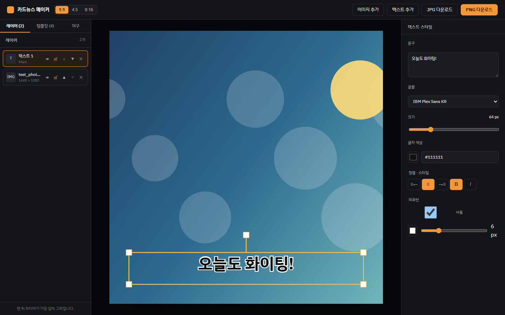

1600×1200 PNG를 올리자 1:1 캔버스에 cover로 배치(1440×1080), 그 위에 문구 레이어 추가.
좌측 레이어 목록에 `test_photo.png`와 `텍스트 1`이 쌓인 것을 확인할 수 있다.

---

## CARD 1 · 증거 ② 텍스트 스타일 실시간 조절

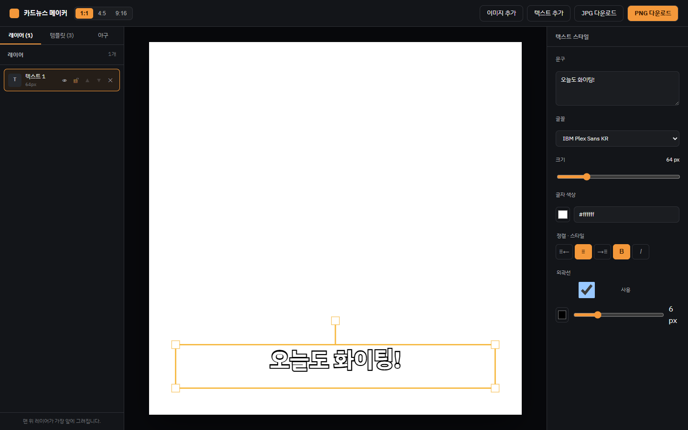

우측 패널에서 문구·글꼴·크기(64px)·색상·정렬·굵기·외곽선(6px)을 조절하면
중앙 캔버스에 지연 없이 즉시 반영된다.

---

## CARD 1 · 증거 ③ 미지원 형식 거부 + 작업 보존

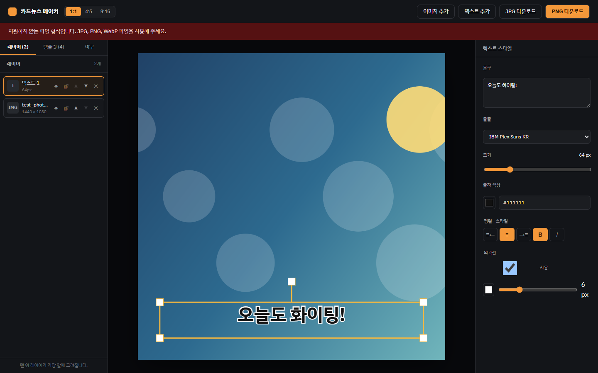

GIF 업로드 → **"지원하지 않는 파일 형식입니다"** 배너.
이때 좌측 레이어 목록의 기존 2개(사진·텍스트)는 **하나도 사라지지 않았다**.

---

## CARD 2 · 화면과 파일의 일치

### "보이는 그대로" 저장되는가

▸ 1:1, 4:5, 9:16 세 비율 원클릭 전환 및 즉시 미리보기
▸ 미리보기 레이아웃 ↔ 내려받은 파일 배치 **완전 일치**
▸ **고해상도 출력 방식**: 내보내는 순간 Stage를 원본 크기·배율 1로 임시 전환한 뒤
  `toDataURL({ pixelRatio: 1 })`로 캡처
  · 화면 맞춤 배율을 나눗셈으로 되돌리던 기존 방식의 **부동소수점 오차(±1px)를 제거**
▸ PNG(무손실) / JPG(품질 90%) 두 포맷 지원, 파일명은 `card-news-YYYYMMDD_HHmmss`

---

## CARD 2 · 증거 — 비율 전환과 해상도 실측

| 비율 | 내보낸 파일 | 기대값 | 일치 |
|---|---|---|---|
| 1:1 | 1080×1080 | 1080×1080 | ✅ |
| 4:5 | 1080×1350 | 1080×1350 | ✅ |
| 9:16 | 1080×1920 | 1080×1920 | ✅ |

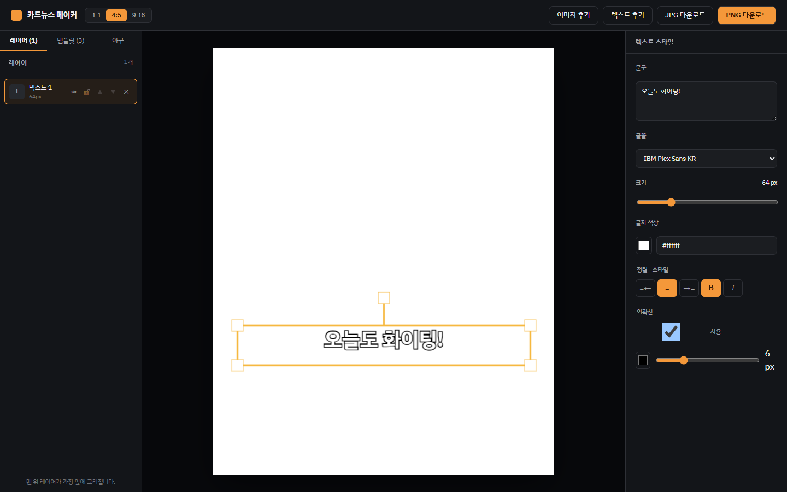 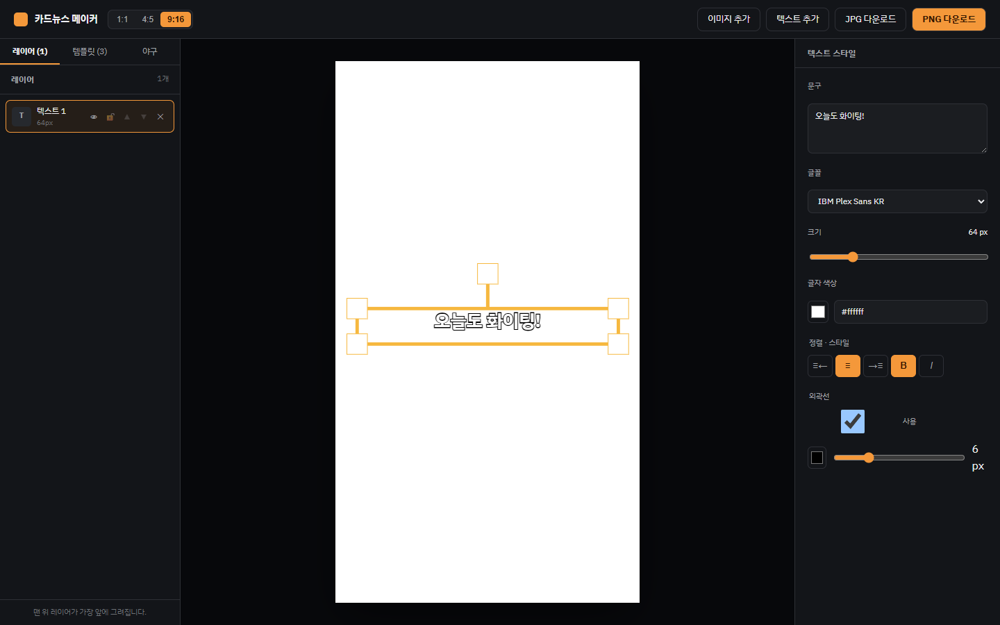

좌: 4:5 미리보기 · 우: 9:16 미리보기 — 세 비율 모두 **오차 0px**로 실측

---

## CARD 3 · 극단 입력 12개 검사표

| 검사 항목 | 결과 | 검사 항목 | 결과 |
|---|---|---|---|
| 매우 긴 한글 문장 | 자동 줄바꿈/잘림 방어 | 빈 텍스트 입력 | 기본 문구 유지 |
| 한/영/숫자 혼합 | 폰트 깨짐 없음 | 이모지 입력 | 렌더링 유지 |
| 여러 줄 강제 줄바꿈 | 행간 정상 | 투명 PNG | 투명도(Alpha) 보존 |
| 가로로 매우 긴 이미지 | 비례 축소·중앙 크롭 | 세로로 매우 긴 이미지 | 비례 축소·중앙 크롭 |
| 초거대 해상도 이미지 | 15MB 상한 + 디코드 실측 90ms | 레이어 캔버스 밖 이탈 | 좌표 유지·내보내기 클리핑 |
| 외곽선 두께 극한값 | 렌더링 유지 | 폰트 크기 극한값(12~240px) | 레이아웃 박스 유지 |

▸ **대표 결함 1건 발견·수정**: 굵은 외곽선 적용 시 글자가 뭉개져 판독 불가
  → Konva `fillAfterStrokeEnabled` 적용으로 해결 (다음 장 전/후 증거)

---

## CARD 3 · 증거 — 결함 수정 전/후

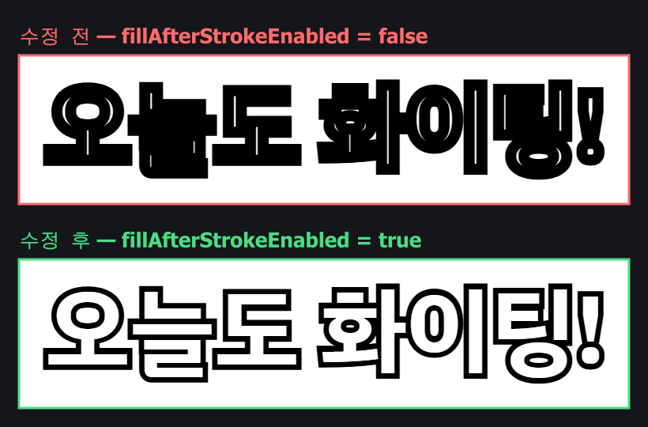

**같은 문구·같은 외곽선 두께(14px)에서 옵션 하나만 바꿔 촬영.**
끄면 외곽선이 글자 속까지 덮어 판독 불가 → 켜면 글자면을 외곽선 위에 다시 채워 정상 표시.

---

## CARD 4 · 실제 템플릿 관리 (CRUD)

▸ **생성(C)** 현재 캔버스를 이름 붙여 템플릿으로 저장
▸ **조회(R)** 목록에서 불러와 캔버스 복원
▸ **수정(U)** 목록에서 이름 즉시 수정
▸ **삭제(D)** 개별 삭제
▸ 기본 템플릿 3종을 최초 실행 시 자동 생성 → 사용자 생성분과 합쳐 관리
▸ `localStorage` 저장과 React 상태 교체를 **함께 처리**해, 저장에 실패하면 화면도 바뀌지 않도록 원자적으로 반영

---

## CARD 4 · 증거 ① 저장 후 목록 반영

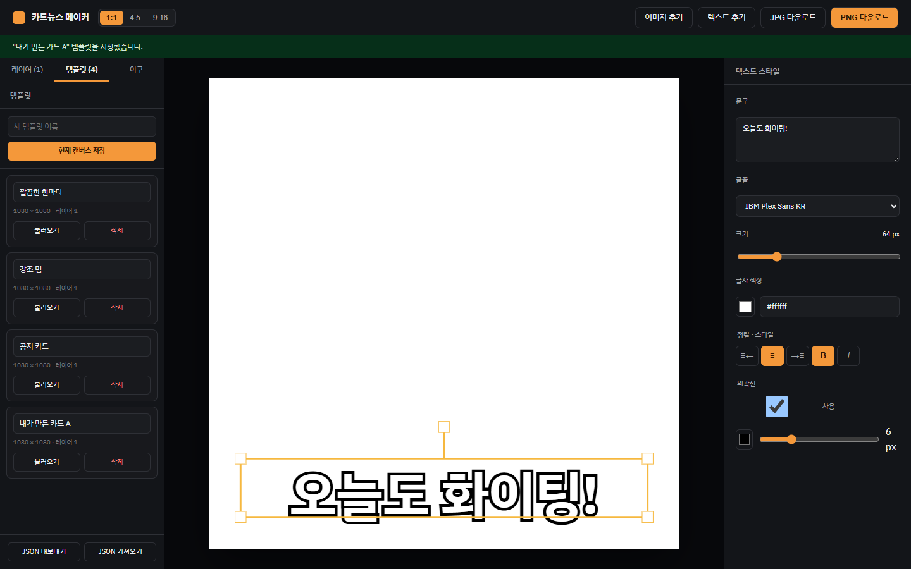

기본 3종(깔끔한 한마디·강조 밈·공지 카드)에 **"내가 만든 카드 A"**를 저장해 총 4개.
각 항목에서 이름 수정·불러오기·삭제가 모두 가능하다.

---

## CARD 4 · 증거 ② 새로고침(F5) 후에도 유지

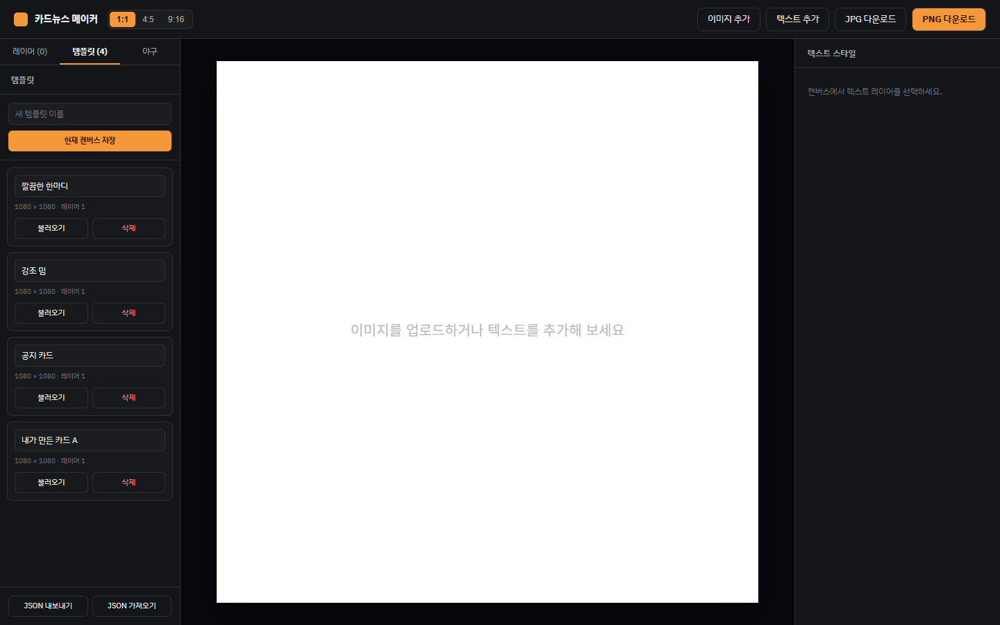

브라우저를 새로고침한 직후 화면. `localStorage`에서 4개가 그대로 복원되며,
사용자가 만든 **"내가 만든 카드 A"**도 남아 있다.

---

## CARD 4 · 템플릿 데이터 항목 정의

| 필드 | 타입 | 설명 |
|---|---|---|
| `id` / `name` | string | 템플릿 식별자 / 사용자 지정 이름 |
| `createdAt` / `updatedAt` | ISO 8601 | 생성·수정 시각 |
| `canvas.width` / `height` | number | 캔버스 크기 (최대 10,000) |
| `canvas.backgroundColor` | string | 배경색 |
| `canvas.layers[]` | Layer[] | 레이어 배열 (최대 500개) |
| 레이어 공통 | — | `id, type, name, x, y, width, height, rotation, zIndex, visible, locked, opacity?` |
| 텍스트 레이어 | — | `text, fontFamily, fontSize, color, bold, italic, align, lineHeight, letterSpacing, strokeColor?, strokeWidth?` |
| 이미지 레이어 | — | `src` (data URI 또는 `/` 시작 경로만 허용) |

---

## CARD 5 · 엣지케이스 방어 (JSON 입출력)

▸ 템플릿 전체를 `{ version: 1, templates: [...] }` 묶음으로 **내보내기 / 가져오기**
▸ **비정상 JSON 2종 방어** — 둘 다 거부하고 기존 데이터를 그대로 보존
  1. **문법 오류**: `JSON.parse` 실패 → 파싱 단계에서 차단
  2. **필수값 누락**: 스키마 검증에서 레이어 필수 필드 누락 탐지 → 로드 거부
▸ **원자적 교체**: 묶음 전체가 검증을 통과한 뒤에야 저장소와 화면을 함께 교체
  → 일부만 반영되어 깨진 상태가 남는 경우가 없다
▸ 이미지 `src`는 **data URI 또는 `/` 시작 경로만 허용**(외부 URL 주입 차단)

---

## CARD 5 · 증거 ① 문법이 깨진 JSON

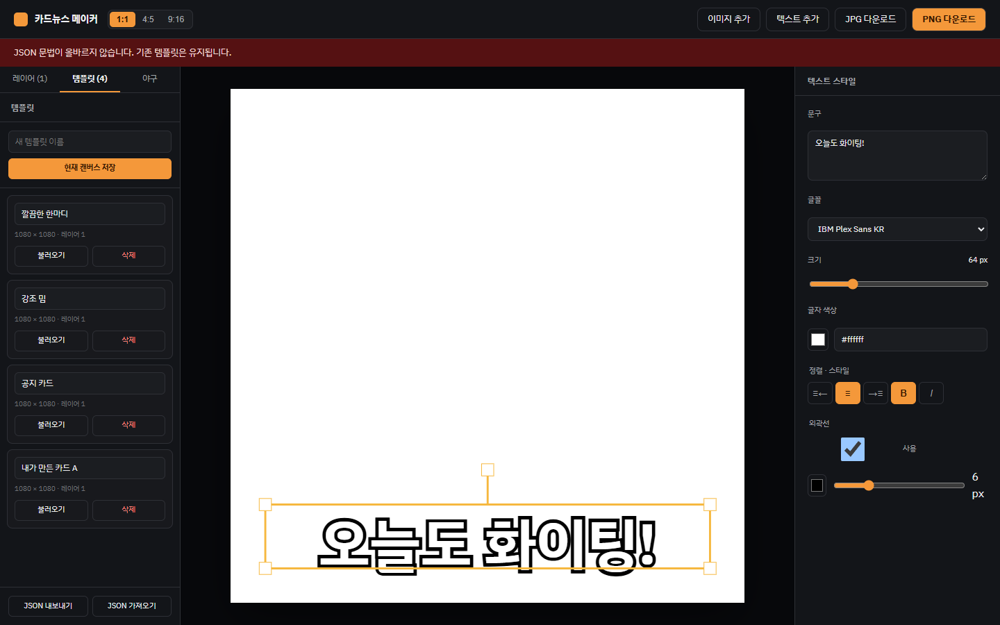

**"JSON 문법이 올바르지 않습니다. 기존 템플릿은 유지됩니다."**
좌측 목록의 템플릿 4개는 그대로 살아 있다.

---

## CARD 5 · 증거 ② 필수값이 빠진 JSON

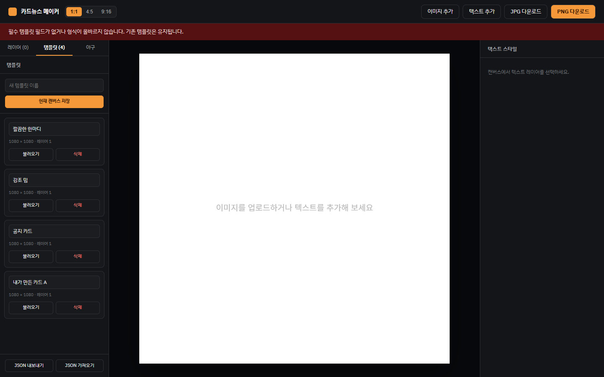

문법은 정상이지만 레이어에 `width·height·zIndex·visible·locked`가 없는 파일.
**"필수 템플릿 필드가 없거나 형식이 올바르지 않습니다"** 로 거부, 기존 4개 보존.

---

## CARD 5 · 증거 ③ 완성본 3종 (모두 1080×1080 PNG)

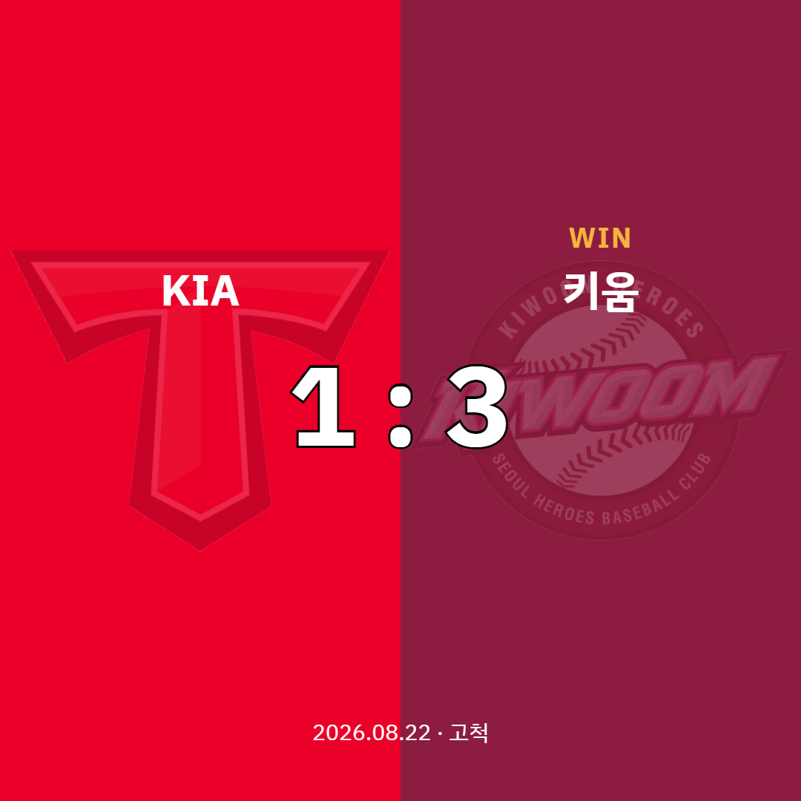 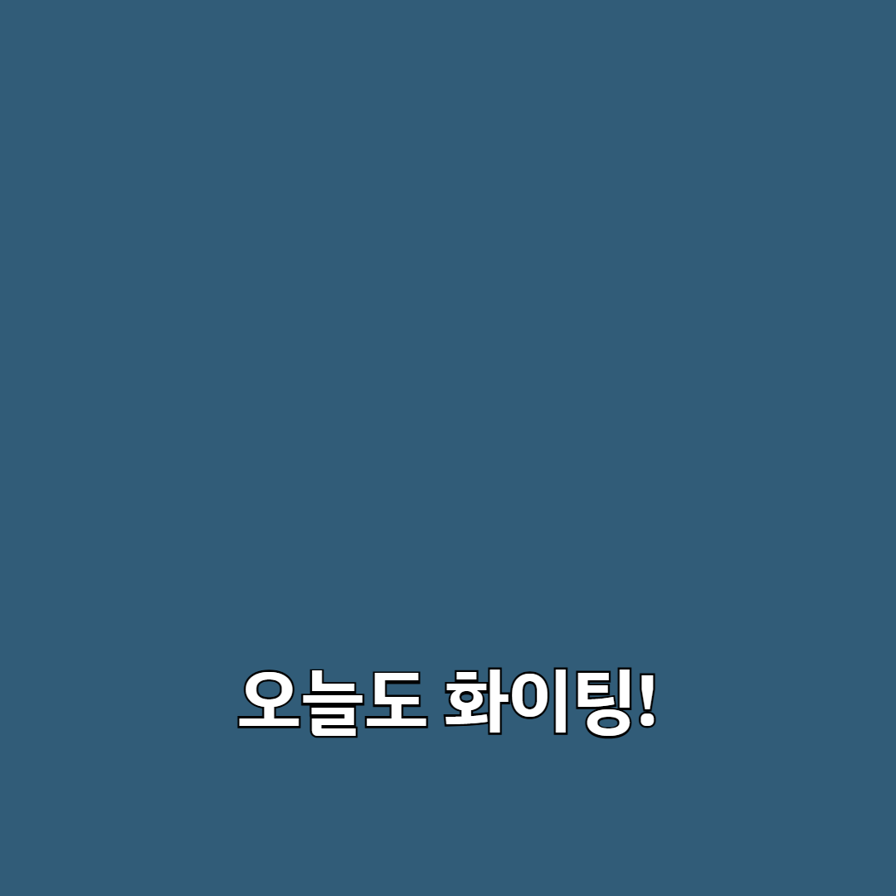 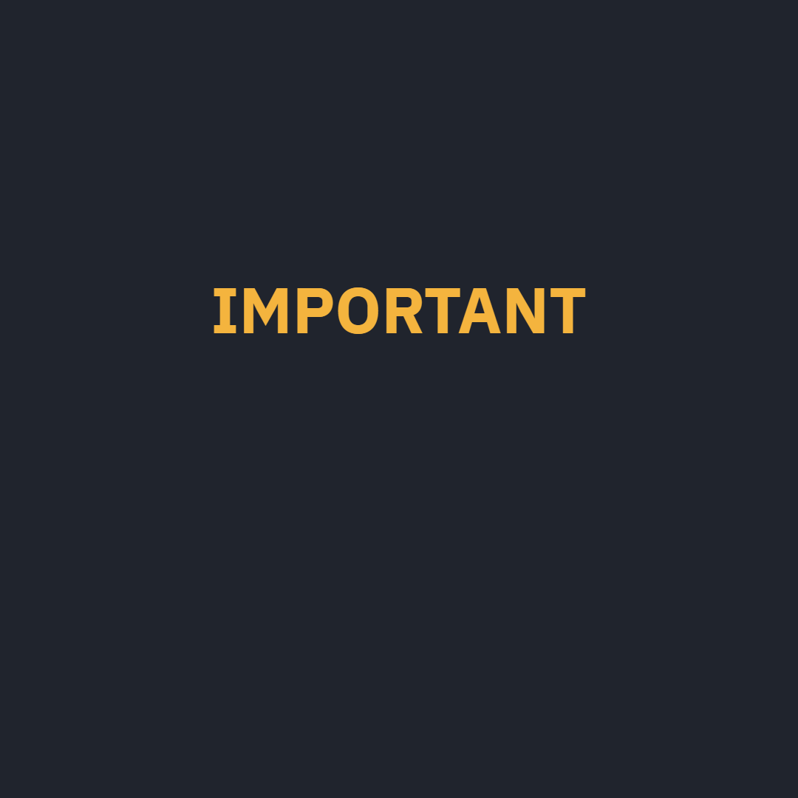

좌: 야구 결과 카드(KBO 실데이터·구단 엠블럼 워터마크) · 중: "강조 밈" · 우: "공지 카드"

▸ Canvas `toDataURL` 산출물이라 **EXIF·위치정보가 원천적으로 없음**
▸ 사용 이미지는 직접 생성했거나 비상업적 과제 용도로 출처를 명시한 것만 사용

---

## 보너스 · 야구 결과 카드 자동 생성

▸ 날짜를 넣으면 **그날 KBO 경기 목록**을 불러와, 클릭 한 번으로 스코어보드 카드 생성
▸ **백엔드**: `GET /api/kbo-schedule?date=YYYY-MM-DD` 서버리스 함수 1개
  · KBO 공식 사이트가 실제로 쓰는 일정 웹서비스를 호출해 `KboGame` 형태로 **정규화**
  · 원본 응답 형식이 바뀌어도 프론트를 고치지 않도록 서버가 완충
▸ **경기 상태 5가지 처리**: 종료 / 취소(사유 표기) / 예정(생성 불가) / 경기 없음 / 조회 실패
▸ 조회 실패 시 **팀·점수 직접 입력 폴백** 제공
▸ 구단 엠블럼 10종은 원본 종횡비를 유지해 배치(찌그러짐 0), 저작권 문구 상시 노출

---

## 보너스 · 증거 — 야구 탭 실제 동작

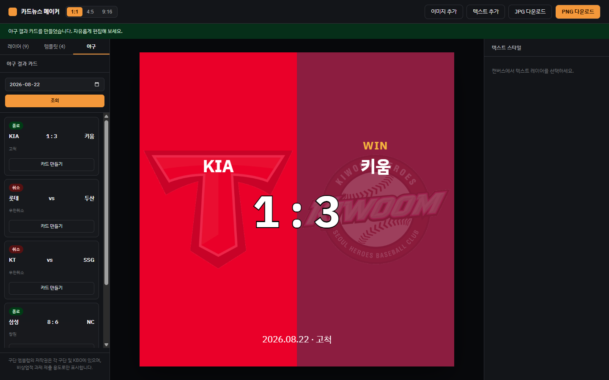

2026-08-22 조회 → 5경기(종료 2 · 우천취소 3) 목록.
KIA 1:3 키움 카드를 생성하니 양 팀 상징색 배경 + 엠블럼 워터마크 + WIN 배지가 자동 구성됐다.

---

## 배포 · Vercel

### https://card-news-maker-beige.vercel.app/

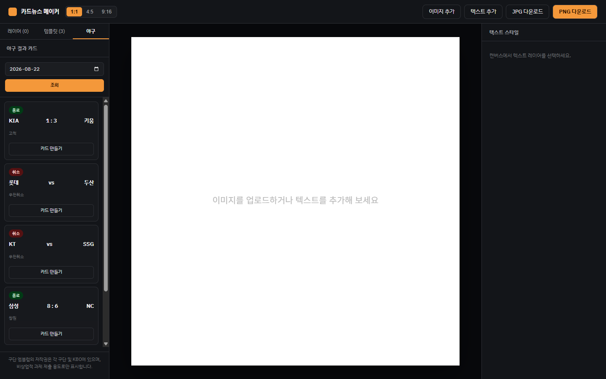

정적 프론트(Vite 빌드) + 서버리스 함수 1개를 함께 배포.
**배포본에서 야구 조회까지 정상 동작**(위 캡처는 배포 URL에서 5경기를 실제로 불러온 화면).
환경변수·시크릿 불필요 — 공개 엔드포인트만 사용한다.

---

## TECH DECISION · 왜 DOM 캡처가 아니라 Canvas인가

> "이 서비스의 결과물은 **픽셀 단위로 정확한 이미지 파일**이다.
> DOM을 html2canvas로 캡처하면 브라우저별 렌더링 편차가 생겨
> '미리보기와 다운로드 결과가 다른' 치명적 결함이 구조적으로 발생한다."

▸ **Canvas(React-Konva) 채택 이유**
  · 미리보기와 `toDataURL` 산출물이 **같은 Stage**에서 나와 불일치가 원천 차단됨
  · 텍스트 외곽선·Z-Index·회전 등 그래픽 제어가 네이티브 수준으로 정밀
  · 내보내기 순간 선택 핸들(Transformer)만 숨기면 되어 후처리가 단순

---

## 트러블슈팅 ① 배포하니 API가 500

▸ **증상**: 로컬은 완벽한데 배포 후 `/api/kbo-schedule`이 `FUNCTION_INVOCATION_FAILED`(500).
  잘못된 날짜를 넣어도 500 — 즉 KBO 호출 이전 단계에서 죽고 있었다.
▸ **원인**: `api/kbo-schedule.ts`가 `from "./_kboClient"`처럼 **확장자 없이** import.
  Vite dev 서버는 이를 허용하지만, Vercel이 실행하는 **Node ESM 런타임은 확장자를 강제**한다.
▸ **재현**: `tsc`로 컴파일한 산출물을 `node`로 직접 실행해 동일 오류 확인
▸ **해결**: `from "./_kboClient.js"`로 수정 (소스는 `.ts`여도 **컴파일 후 파일명**에 맞춰야 함)
▸ **배운 점**: `npm run dev`만으로는 절대 안 잡히는 사각지대가 있다.
  배포 런타임과 다른 리졸버를 쓰는 구간은 **컴파일 산출물로 검증**해야 한다.

---

## 트러블슈팅 ② 배경이 단색으로만 보임

▸ **증상**: 야구 카드의 양 팀 분할 배경이 한 가지 색으로만 렌더링됨
▸ **원인 추적**: 야구 기능의 버그로 보였지만, 실제로는 공용 렌더러 `CanvasStage.tsx`가
  **처음부터 `type: "shape"` 레이어를 그리지 않고 있었다**.
  템플릿 검증 로직에는 shape 분기가 있었는데 렌더러에만 빠져 있어 아무도 눈치채지 못했다.
▸ **해결 선택**: 야구 쪽에서 도형 대신 이미지로 우회할 수도 있었지만,
  **모든 레이어가 지나가는 공용 렌더러에 `Rect`/`Circle` 분기를 추가**해 근본 수정
▸ **배운 점**: 증상이 난 기능만 고치면 같은 결함이 다른 기능에서 다시 터진다.
  호출 경로가 모이는 지점을 찾아 한 번만 고치는 편이 결국 더 작은 수정이다.

---

## 트러블슈팅 ③ 지정한 폰트가 한 번도 안 쓰이고 있었다

▸ **증상 아닌 증상**: 화면은 멀쩡해 보였다. 아무도 문제라고 느끼지 못했다.
▸ **발견**: 코드 전체가 `IBM Plex Sans KR`을 지정하는데,
  `index.html`에 웹폰트 로드 링크도, npm 패키지도, 로컬 폰트 파일도 **없었다**.
  브라우저가 조용히 `Malgun Gothic`으로 폴백하고 있었던 것.
▸ **해결 2단계**
  1. `index.html`에 Google Fonts 로드 추가
  2. Konva는 **그리는 순간 로드된 폰트만** 쓰므로, `document.fonts.ready` 후 캔버스를 다시 그리게 함
     (이게 없으면 첫 렌더가 폴백 폰트로 굳어버린다)
▸ **배운 점**: "지정했으니 적용됐겠지"는 검증이 아니다. 실제 적용 여부를 **측정**해야 한다
  (같은 문자열의 렌더링 폭을 폴백 폰트와 비교해 확인했다).

---

## AI 3줄

▸ **AI에게 맡긴 일**
React-Konva 캔버스 구조 설계와 구현, KBO 일정 API 조사·정규화 계층 작성,
JSON 파서 방어 코드, Chrome DevTools 기반 브라우저 실검증 및 증거 캡처.

▸ **내가 판단한 일**
`localStorage` 템플릿 스키마 구조 결정, 구단 로고 수집·사용 정책(비상업적·출처 명시) 수립,
제출 범위 확정(수익화 기능 제외), 야구 탭을 보너스로 추가할지의 우선순위 결정.

▸ **AI 말을 안 들은 일**
AI가 SSR 백엔드로 서비스를 확장하자고 제안했으나 **과제 범위를 넘어서므로 반려**했다.
또 외곽선 뭉개짐을 AI는 폰트 문제로 진단했으나, 직접 Konva 옵션을 찾아
`fillAfterStrokeEnabled` 적용을 지시해 해결했다.
MVP 선수 사진 기능도 AI가 구현까지 마쳤지만, 저작권 판단으로 **최종 철회**시켰다.

---

## 검증 안내서 ① 어디로 가나요 / 무엇을 하나요

### 어디로 가나요

▸ https://card-news-maker-beige.vercel.app/ 접속 (설치·로그인 불필요)

### 무엇을 하나요 — 3단계, 30초

1. **비율 고르고 사진 올리기** — 상단 `4:5` 클릭 → `이미지 추가`로 PNG/JPG 선택
2. **문구 얹고 템플릿 저장** — `텍스트 추가` → 우측 패널에서 색·크기·외곽선 조절
   → 좌측 `템플릿` 탭에서 이름 입력 후 `현재 캔버스 저장` → **F5 새로고침**
3. **내려받기** — 상단 `PNG 다운로드` 클릭

---

## 검증 안내서 ② 통과 기준 / 안 될 때

### 무엇이 보이면 통과인가요

▸ 1단계: 사진이 캔버스를 꽉 채우고, 비율 버튼을 바꾸면 캔버스 모양이 즉시 바뀐다
▸ 2단계: 문구 색·크기 변경이 **지연 없이** 반영되고, F5 후에도 저장한 템플릿이 목록에 남아 있다
▸ 3단계: 받은 PNG를 열었을 때 **화면과 배치가 같고**, 크기가 정확히 1080×1350이다

### 안 될 때

| 증상 | 확인할 것 |
|---|---|
| 이미지가 안 올라감 | GIF·BMP는 미지원 — PNG/JPG/WebP로, 15MB 이하인지 확인 |
| 템플릿이 사라짐 | 시크릿 모드는 `localStorage`가 비워짐 — 일반 창에서 재시도 |
| 야구 조회 실패 | 그날 경기가 없거나 KBO 응답 지연 — 목록 하단 **직접 입력 폴백** 사용 |
| 다운로드가 안 됨 | 브라우저 다운로드 차단 설정 확인 |

---

## 자체 점검 20개 매핑 (1 ~ 10)

| # | 점검 항목 | 상태 | 증빙 |
|:--:|---|:--:|---|
| 1 | PNG·JPEG 불러오기 + 문구 변경 즉시 반영 | ✅ | 증거 ①② |
| 2 | 미지원 파일 입력 시 작업 보존 + 오류 표시 | ✅ | 증거 ③ |
| 3 | 불러오기 화면 파일 확보 | ✅ | `ev01_image_upload.png` |
| 4 | 문구 위치·크기·색 변경 결과 화면 일치 | ✅ | `card1_editor_text_style.png` |
| 5 | 1:1·4:5·9:16 비율 및 미리보기↔파일 일치 | ✅ | 해상도 실측표 |
| 6 | 내려받은 파일 글자 깨짐·흐림 없음 | ✅ | 완성본 3종 |
| 7 | 화면과 파일 일치 점검표 | ✅ | CARD 2 증거표 |
| 8 | 극단 입력 12개 + 결함 1건 수정 전/후 | ✅ | CARD 3 검사표·비교 |
| 9 | 잘못된 입력에서도 기존 편집 보존 | ✅ | `ev02_gif_rejected.png` |
| 10 | 극단 입력 12개 검사표 정리 | ✅ | CARD 3 표 |

---

## 자체 점검 20개 매핑 (11 ~ 20)

| # | 점검 항목 | 상태 | 증빙 |
|:--:|---|:--:|---|
| 11 | 대표 결함 수정 전·후 파일 확보 | ✅ | `card3_stroke_before_after.png` |
| 12 | 템플릿 3개 이상 생성 및 복원 | ✅ | 기본 3종 + 사용자 1종 |
| 13 | 수정·삭제 반영 및 F5 유지 | ✅ | `ev03_persist_after_reload.png` |
| 14 | 생성·불러오기·수정·삭제 검사 기록 | ✅ | CARD 4 증거 ①② |
| 15 | 템플릿 데이터 항목 목록 정의 | ✅ | 데이터 항목 표 |
| 16 | 정상 복원 + 비정상 JSON 2종 거부 | ✅ | 증거 ①② |
| 17 | 정상·비정상 2종 검사 기록 | ✅ | CARD 5 두 장 |
| 18 | 완성 결과물 3개 (EXIF 없음) | ✅ | 완성본 3종 |
| 19 | 개인정보·비밀값 0건 | ✅ | 전수 grep 0건 |
| 20 | 검증 안내서(4단락·3단계) + AI 3줄 | ✅ | 앞 3개 슬라이드 |

---

## FINAL STATUS

| 항목 | 결과 |
|---|---|
| 카드 1 ~ 5 필수 요구사항 | 전부 충족 |
| 자체 점검 20개 항목 | 20 / 20 |
| 증거 자료 | 캡처 11 + 완성본 3 = **14종** (`docs/evidence/`) |
| 빌드 검증 | `tsc -b` · `oxlint` · `vite build` 전부 통과 |
| 콘솔 오류 | 0건 |
| 개인정보·비밀값 | 0건 (`grep -rniE` 전수 검사, 매치 없음) |
| 배포 | https://card-news-maker-beige.vercel.app/ (서버리스 API 포함 정상) |
| 보너스 | KBO 야구 결과 카드 자동 생성 (Phase 4) |

**본 자료의 모든 캡처는 실제 실행 화면이며, 수치는 전부 실측값입니다.**
